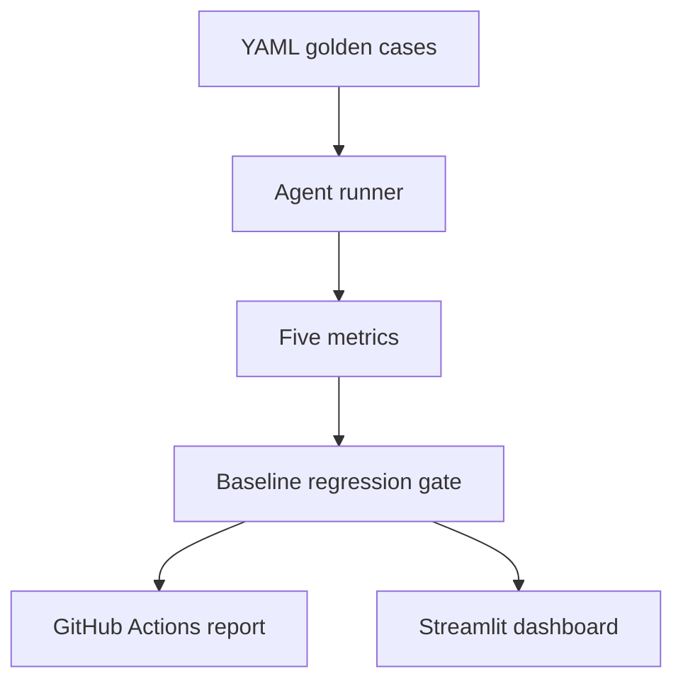
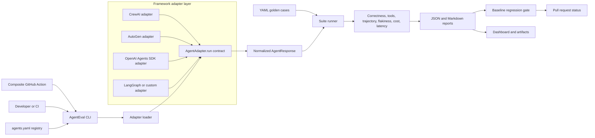
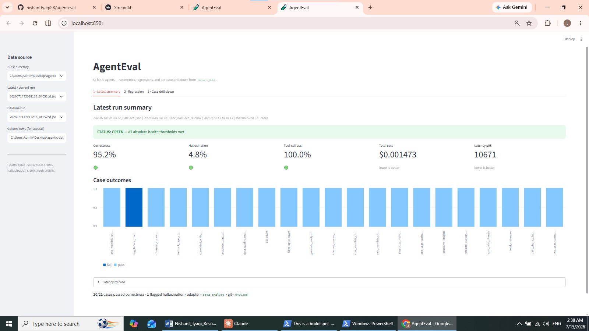
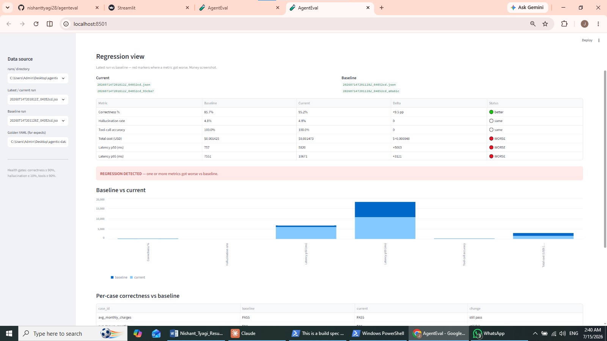
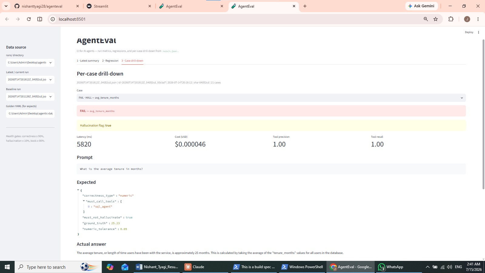

# AgentEval

[](https://github.com/nishanttyagi28/agenteval/actions/workflows/eval.yml)
[](https://pypi.org/project/nishanttyagi-agenteval/)
[](https://pypi.org/project/nishanttyagi-agenteval/)
[](LICENSE)
[](pyproject.toml)
[](https://agenteval-6honbe24hradazngswxkrq.streamlit.app/)

**CI for AI agents — pytest and GitHub Actions style evaluation for LLM systems.**

AgentEval runs an agent against YAML golden suites, scores five reliability metrics, compares results with a versioned baseline, and turns regressions into a reviewable CI decision.

**Catch broken answers, wrong tool choices, flaky behavior, and regressions before your AI agent reaches production.**

**[Explore the static AgentEval demo](https://nishanttyagi28.github.io/agenteval/)**

**[Open the live dashboard](https://agenteval-6honbe24hradazngswxkrq.streamlit.app/)**

The static demo explains the workflow without executing an agent or making API calls. The Streamlit dashboard presents stored evaluation evidence and historical runs.

## Table of contents

- [Why AgentEval](#why-agenteval)
- [Evaluation flow](#evaluation-flow)
- [Architecture](#architecture)
- [Five metrics](#five-metrics)
- [Failure taxonomy and gate integrity](#failure-taxonomy-and-gate-integrity)
- [Flakiness detection](#flakiness-detection)
- [Trajectory scoring](#trajectory-scoring)
- [Golden case example](#golden-case-example)
- [Dashboard evidence](#dashboard-evidence)
- [Installation](#installation)
- [Quickstart with Agentic Data Analyst](#quickstart-with-agentic-data-analyst)
- [Supported frameworks](#supported-frameworks)
- [CrewAI adapter](#crewai-adapter)
- [Microsoft AutoGen adapter](#microsoft-autogen-adapter)
- [OpenAI Agents SDK adapter](#openai-agents-sdk-adapter)
- [GitHub Actions](#github-actions)
- [Adversarial robustness](#adversarial-robustness)
- [HTML reports and regression trend tracking](#html-reports-and-regression-trend-tracking)
- [VS Code extension](#vs-code-extension)
- [Project structure](#project-structure)
- [Testing](#testing)
- [Current limitations](#current-limitations)
- [Contributing](#contributing)
- [License](#license)

## Why AgentEval

LLM agents are probabilistic. A prompt, model, or tool change can improve one answer while silently reducing correctness elsewhere, increasing hallucinations, or raising latency and cost. Traditional unit tests remain useful for deterministic code, but they do not fully cover model outputs, tool routing, or quality drift across versions.

AgentEval adds the missing evaluation layer:

- YAML-defined golden test cases
- deterministic-first scoring with an LLM judge only for open-ended answers
- baseline comparison and configurable regression gates
- explicit agent, evaluator, missing-case, and skipped-case failures
- opt-in repeat consistency evidence for flaky outputs
- optional LCS-based trajectory evidence for expected agent steps
- a Streamlit dashboard for summary, regression, and case-level inspection
- GitHub Actions automation with a six-case smoke suite and optional 21-case full suite
- reviewable adversarial variants that remain outside blocking CI until approved

| Capability | AgentEval | Manual spot checks | Custom eval scripts |
|---|:---:|:---:|:---:|
| Versioned golden cases | ✅ | ❌ | ⚠️ You build it |
| Correctness and hallucination scoring | ✅ | Subjective | ⚠️ You build it |
| Tool-call and trajectory evidence | ✅ | Easy to miss | ⚠️ Framework-specific |
| Flakiness detection | ✅ | Impractical | ⚠️ You build it |
| Cost and latency tracking | ✅ | Rarely captured | ⚠️ Provider-specific |
| Baseline regression gate | ✅ | ❌ | ⚠️ You maintain it |
| JSON and Markdown reports | ✅ | ❌ | ⚠️ You build it |
| Reusable GitHub Action | ✅ | ❌ | ⚠️ You maintain it |

## Evaluation flow



1. Define the prompt, ground truth, required tools, and tolerance in YAML.
2. Run each case through an adapter for the agent under test.
3. Score the output and store a provenance-linked JSON run.
4. Compare the current report with a versioned baseline.
5. Fail CI when configured quality gates or case-integrity checks are violated.
6. Inspect suite and case-level evidence in the dashboard.

## Architecture



Every framework adapter returns the same `AgentResponse` fields: output, tool calls, fired nodes, token usage, cost, latency, and JSON-safe raw evidence. The runner, scoring, comparison, and reporting layers therefore remain framework-independent.

## Five metrics

| Metric | What it evaluates | Implementation |
|---|---|---|
| **Correctness** | Whether the answer matches the expected result | Exact, contains, numeric, numeric-table, or LLM-judge checks |
| **Hallucination rate** | Unsupported numeric or factual claims | Deterministic ground-truth comparison |
| **Tool-call accuracy** | Whether the required tools were invoked | Precision, recall, and suite-level F1 |
| **Latency** | Response-time distribution | p50 and p95 wall-clock latency |
| **Cost** | Estimated or provider-reported usage cost | Per-case and suite-level USD estimate |

Correctness uses the exact tolerance configured in YAML. Hallucination detection applies a separate minimum absolute tolerance of 0.01 for harmless numeric formatting noise; that floor cannot convert an incorrect answer into a correctness pass.

## Failure taxonomy and gate integrity

AgentEval distinguishes output quality from execution and evaluation failures:

| Status | Meaning | Quality denominators | Default gate behaviour |
|---|---|---:|---|
| `failed` | The agent ran but failed an expectation | Included | Can fail metric gates |
| `agent_error` | Provider, ingestion, SQL, adapter, or execution failure | Excluded | Fails loudly |
| `evaluator_error` | The evaluator or LLM judge could not produce a valid decision | Excluded | Fails loudly |
| `skipped` | A case produced no scored result | Excluded | Fails loudly |
| `missing` | A baseline case is absent from the current run | Not applicable | Fails loudly |

Infrastructure failures are not counted as incorrect or hallucinated answers, so provider outages do not corrupt quality rates. They remain visible and fail the regression gate by default. Missing and skipped cases are also gated to prevent an incomplete run from appearing healthy.

## Flakiness detection

LLM agents can produce different answers for the same prompt even when the code and inputs have not changed. AgentEval's opt-in repeat mode separates two different problems: an agent can be **consistently wrong** (the same failing verdict every time) or **flaky** (the verdict or comparable numeric value changes across observations). The report stores both consistency and pass rate so repeatability is never mistaken for correctness.

Run the normal suite once and repeat only explicitly selected cases:

```bash
agenteval run \
  --agent agentic_data_analyst \
  --repeat 5 \
  --repeat-case total_customers \
  --repeat-case avg_monthly_charges
```

`--repeat 5` means five total observations for each selected case: the primary suite result plus four additional invocations. Requiring explicit `--repeat-case` values prevents an accidental N-times increase in API calls across the full suite. The default `--repeat 1` follows the existing single-pass path without creating flakiness evidence.

| Classification | Consistency score |
|---|---:|
| `stable` | `1.0` |
| `flaky` | `0.80` to `<1.0` |
| `unstable` | `<0.80` |

These labels are documented defaults rather than information-losing buckets: every artifact retains the raw consistency fraction, such as `4/5`, so thresholds can be adjusted later.

Scalar numeric cases use `largest_complete_link_cluster`. Values cluster when the difference between the cluster maximum and minimum remains within the case's existing `numeric_tolerance`; the largest same-verdict cluster wins, and the primary observation receives no special preference. Exact, contains, and LLM-judge cases use verdict consistency. Ambiguous scalar numeric answers and numeric-table cases also fall back to verdict-only consistency.

Flakiness is observability-only in this phase. It does not affect the regression gate or baseline comparison. Evidence is stored separately under `runs/<agent>/flakiness/<run_id>.json`, keeping repeated latency, cost, answers, and verdicts isolated from the primary run report.

## Trajectory scoring

Trajectory scoring adds step-level evidence about how an agent reached its answer. A golden case can optionally declare the expected ordered events alongside its existing output expectations:

```yaml
- id: total_customers
  prompt: "How many customers are in the dataset?"
  expects:
    correctness_type: numeric
    ground_truth: 7043
    expected_trajectory: ["route:sql", "agent:sql"]
```

AgentEval compares `expected_trajectory` with the adapter's actual `nodes_fired` sequence using a longest common subsequence (LCS). The matched subsequence produces precision (matched steps divided by actual steps), recall (matched steps divided by expected steps), and their F1 score, while preserving evidence about exact match, ordering, missing steps, and extra steps. Duplicate steps retain their multiplicity.

The field is optional and backward compatible: cases without it are scored and serialized exactly as before. Trajectory scoring is observability-only in v1 and does not affect correctness, existing metrics, baseline comparison, or CI gates.

## Golden case example

```yaml
- id: avg_tenure_months
  prompt: "What is the average tenure in months?"
  expects:
    correctness_type: numeric
    must_call_tools: [sql_agent]
    must_not_hallucinate: true
    ground_truth: 25.23
    numeric_tolerance: 0.05
```

The current analyst suite contains 21 hand-written cases grounded in the demonstration dataset.

## Dashboard evidence

AgentEval is integrated with [Agentic Data Analyst](https://github.com/nishanttyagi28/agentic-data-analyst), a modular application that routes natural-language questions to SQL, ML, statistics, forecasting, reporting, and RAG components.

### Historical run summary



The screenshot records a specific historical run; it is evidence from that run, not a claim about the current deployment state.

### Regression trade-off



The comparison view exposes trade-offs instead of collapsing health into one number. In the recorded example, correctness improved from 85.7% to 95.2%, while p95 latency and estimated cost both increased.

### Failure drill-down



A numeric answer of approximately 25 months failed against a ground truth of 25.23 with a tolerance of 0.05. The ground truth was intentionally preserved rather than loosened to produce a green result.

## Installation

Install the published package from PyPI:

```bash
python -m pip install nishanttyagi-agenteval
agenteval --help
```

Install only the framework integration you need:

```bash
python -m pip install "nishanttyagi-agenteval[crewai]"
python -m pip install "nishanttyagi-agenteval[autogen]"
python -m pip install "nishanttyagi-agenteval[openai-agents]"
```

The PyPI distribution is named `nishanttyagi-agenteval`, while the Python package and console command remain `agenteval`:

```python
import agenteval
```

Both `agenteval ...` and `python -m agenteval ...` invoke the same CLI. For contributors working from a clone, use an editable install instead:

```bash
git clone https://github.com/nishanttyagi28/agenteval
cd agenteval
python -m pip install -e .
python -m pip install -r requirements-dev.txt
```

Alternatively, install the repository's development extra with `python -m pip install -e ".[dev]"`.

## Quickstart with Agentic Data Analyst

Python 3.12 is used by the CI workflow.

```bash
mkdir agenteval-demo && cd agenteval-demo
git clone https://github.com/nishanttyagi28/agenteval
git clone https://github.com/nishanttyagi28/agentic-data-analyst
python -m pip install -e ./agenteval
python -m pip install -r agentic-data-analyst/requirements.txt

export AGENTIC_ANALYST_PATH="$PWD/agentic-data-analyst"

# Run all golden cases
agenteval run

# Compare a current report with the versioned baseline
agenteval compare \
  --baseline agenteval/baselines/data_analyst.json \
  --current agenteval/runs/<run>.json

# Launch the dashboard
python -m streamlit run agenteval/dashboard/app.py
```

The repositories may live anywhere when `AGENTIC_ANALYST_PATH` points to the Agentic Data Analyst checkout. Keeping them as siblings also supports the default local discovery path.

## Supported frameworks

All framework integrations are optional at import time, so AgentEval's core does not require every agent SDK.

| Framework | Support | Adapter entry point | Captured evidence |
|---|---|---|---|
| [CrewAI](https://docs.crewai.com/) | First-party adapter | `agenteval.adapters.crewai:CrewAIAdapter` | Tasks, agents, tools, usage, cost, output |
| [Microsoft AutoGen](https://microsoft.github.io/autogen/stable/) | First-party adapter | `agenteval.adapters.autogen:AutoGenAdapter` | Agent messages, tools, trajectory, usage, cost, output |
| [OpenAI Agents SDK](https://openai.github.io/openai-agents-python/) | First-party adapter | `agenteval.adapters.openai_agents:OpenAIAgentsAdapter` | Run items, tools, handoffs, usage, cost, output |
| [LangGraph](https://langchain-ai.github.io/langgraph/) | Contract-native | Custom `AgentAdapter` around the compiled graph | Graph state, tool calls, nodes, usage, output |
| Any Python agent | Stable public contract | Subclass `agenteval.adapters.base.AgentAdapter` | Any evidence mapped to `AgentResponse` |

LangGraph uses the public adapter contract in this release; the repository does not currently claim a dedicated `LangGraphAdapter` module.

## CrewAI adapter

Install the optional CrewAI integration and wrap either an existing crew or a
factory that creates fresh crew state for each evaluation case:

```bash
python -m pip install -e ".[crewai,dev]"
```

```python
from agenteval.adapters import CrewAIAdapter

adapter = CrewAIAdapter(
    crew_factory=lambda: LatestAiDevelopmentCrew().crew(),
    input_key="topic",
    inputs={"audience": "engineering leaders"},
)
response = adapter.run("AI agent reliability")
```

To use a standard CrewAI `CrewBase` project through `agenteval run`, point a
registry entry at the adapter and name the importable crew class. AgentEval
adds both the configured repository root and its conventional `src/` directory
to the import path:

```yaml
adapter: agenteval.adapters.crewai:CrewAIAdapter
repository:
  env_var: MY_CREW_PATH
  default_path: ../my-crew
  required_paths: [src/my_crew/crew.py]
adapter_options:
  crew_import: my_crew.crew:MyCrew
  input_key: topic
```

The adapter calls `crew.kickoff(inputs=...)` and normalizes the final raw
output, task and agent trajectory, observed tool calls, token usage, latency,
and JSON-safe execution evidence into the standard `AgentResponse`. Existing
crew-level step callbacks are chained and restored. CrewAI remains optional at
AgentEval import time; pass `crew_factory` when independent state per case is
important, or `crew` when the same instance should be reused.

## Microsoft AutoGen adapter

AutoGen's AgentChat `run(task=...)` method is asynchronous. The adapter preserves AgentEval's synchronous contract and safely handles ordinary scripts, notebooks, and applications that already have an event loop.

```python
from agenteval.adapters import AutoGenAdapter

adapter = AutoGenAdapter(
    agent_factory=build_fresh_autogen_agent,
    input_cost_per_million=2.50,
    output_cost_per_million=10.00,
)
response = adapter.run("Research the release notes")
```

Use `agent_factory` or `agent_import` for isolated state per golden case. A direct `agent` instance intentionally retains AutoGen's documented conversation state. Provider and network failures propagate to the runner so they are recorded as `agent_error` rather than successful answers.

For registry-driven CLI runs, configure the adapter with an importable agent or factory:

```yaml
adapter: agenteval.adapters.autogen:AutoGenAdapter
adapter_options:
  agent_import: my_autogen_project.agents:build_research_agent
  input_cost_per_million: 2.50
  output_cost_per_million: 10.00
```

## OpenAI Agents SDK adapter

The OpenAI Agents SDK adapter captures final output, tool calls, handoffs, agent trajectory, token usage, provider-reported or configured cost, latency, interruptions, and bounded JSON-safe run evidence.

```python
from agenteval.adapters import OpenAIAgentsAdapter

adapter = OpenAIAgentsAdapter(
    agent_factory=build_fresh_openai_agent,
    run_options={"max_turns": 8},
)
response = adapter.run("Check the deployment evidence")
```

The adapter uses `Runner.run_sync` in ordinary synchronous code and `Runner.run` through a safe bridge when an event loop is already active. Provider failures propagate to the runner and are recorded as `agent_error`.

For registry-driven CLI runs:

```yaml
adapter: agenteval.adapters.openai_agents:OpenAIAgentsAdapter
adapter_options:
  agent_import: my_agents.support:build_support_agent
  run_options:
    max_turns: 8
```

## GitHub Actions

`.github/workflows/eval.yml` runs on pull requests and manual dispatch:

- deterministic unit tests and CLI validation run first
- an internal pull request or manual dispatch can run the live evaluation
- pull requests use six selected smoke cases
- manual dispatch with `full_suite=true` runs all 21 golden cases
- the current report is compared with the versioned baseline
- evidence is uploaded as a workflow artifact
- a generated Markdown report is created or updated on the pull request
- missing `GROQ_API_KEY` produces an explicit skipped-evaluation summary
- concurrency cancellation and job timeouts prevent stale or runaway runs

### Reusable composite action

The root `action.yml` lets another repository install AgentEval, run a registered agent, compare the report with its baseline, and expose the result to later workflow steps.

After a stable `v1` tag is published, consume the action with:

```yaml
name: AgentEval

on:
  pull_request:

permissions:
  contents: read

jobs:
  evaluate:
    runs-on: ubuntu-latest
    steps:
      - uses: actions/checkout@v5

      - name: Run AgentEval
        id: agenteval
        uses: nishanttyagi28/agenteval@v1
        with:
          agent: research_crew
          config-file: agents.yaml
          agent-path: .
          cases-file: tests/golden/research.yaml
          baseline-file: baselines/research_crew.json
          runs-dir: .agenteval/runs
          install-extras: crewai
          no-llm-judge: "true"
```

Supported inputs include the registered agent, registry path, agent repository path, golden-case and baseline overrides, run directory, case IDs, tags, framework extras, Python version, LLM-judge behavior, and regression-failure behavior. The action exposes `passed`, `report-path`, and `comparison-path` outputs. See [the complete consumer workflow](examples/github-actions/agenteval.yml).

GitHub resolves `uses` references as `owner/repository@ref`. Because the composite action is maintained in this repository, its coordinate is `nishanttyagi28/agenteval@v1`. The separate coordinate `nishanttyagi28/agenteval-action@v1` would require a repository named `agenteval-action`.

The dedicated `.github/workflows/action-smoke.yml` workflow consumes the local composite action with deterministic fixtures and verifies both the gate decision and generated report paths.

## Adversarial robustness

Generate reviewable, expectation-preserving candidates:

```bash
agenteval generate \
  --cases tests/golden/analyst_cases.yaml \
  --variants 3 \
  --output tests/adversarial/candidates.yaml
```

Each candidate retains its parent case, ground truth, tool expectations, and mutation type. New variants start with `review_status: candidate` and are not added to the blocking golden gate until reviewed.

## HTML reports and regression trend tracking

Every scored `agenteval run` appends a lightweight entry (the five metrics,
run id, timestamp, gate outcome) to `runs/<agent>/history.json`, capped at
the last N runs (`--history-limit`, default 20; `--no-history` to opt out).
No database — just a small JSON ledger, atomically written.

Turn the latest run (plus that history and, if configured, the baseline)
into a single self-contained HTML file:

```bash
agenteval report
# or explicitly:
agenteval report \
  --agent agentic_data_analyst \
  --run runs/<run>.json \
  --output runs/report.html
```

The report shows per-case results, the five metrics with baseline delta
badges, a gate PASS/FAIL banner with reasons, a case-outcome status bar, and
a trend table (sparkline + improving/regressing/stable) for each metric
across the recorded history. It has no external CSS/JS dependencies, so it's
safe to open directly or publish as a CI artifact — see `agenteval report
--help` for baseline/history overrides.

## VS Code extension

`vscode-extension/` is a minimal VS Code extension that adds **AgentEval: Run
Suite** to the command palette — it shells out to `python -m agenteval run`
in the current workspace and streams output into an "AgentEval" output
channel. It's an unpublished local scaffold; see
[`vscode-extension/README.md`](vscode-extension/README.md) for how to build
and debug it (`npm install && npm run compile`, then `F5`).

## Project structure

```text
agenteval/
├── pyproject.toml        # Package metadata and agenteval console entry point
├── agents.yaml           # Registered agents, adapters, suites, and gate defaults
├── action.yml            # Reusable composite GitHub Action
├── CONTRIBUTING.md       # Development and pull-request guidance
├── adapters/             # Agent interface and concrete adapter
│   ├── base.py           # Framework-neutral AgentAdapter contract
│   ├── crewai.py         # CrewAI integration
│   ├── autogen.py        # Microsoft AutoGen integration
│   └── openai_agents.py  # OpenAI Agents SDK integration
├── core/
│   ├── schema.py         # Test-case and run-report models
│   ├── runner.py         # Suite execution
│   ├── flakiness.py      # Repeat consistency analysis and classification
│   ├── trajectory.py     # Step-sequence evaluation and evidence
│   ├── metrics.py        # Correctness, hallucination, tools, latency, cost
│   ├── judge.py          # LLM judge for open-ended correctness
│   ├── compare.py        # Baseline comparison and CI decision
│   ├── history.py        # Regression trend ledger across the last N runs
│   ├── report.py         # Static HTML report generator (`agenteval report`)
│   ├── provenance.py     # Reproducibility metadata
│   ├── _fsutil.py        # Atomic file writes shared by store/history/report
│   └── store.py          # JSON run persistence
├── dashboard/app.py      # Streamlit dashboard
├── vscode-extension/     # Minimal "AgentEval: Run Suite" VS Code extension
├── landing-page/         # Static demo and Playwright browser tests
├── examples/             # Composite-action fixtures and consumer workflow
├── tests/golden/         # Hand-written YAML suite
├── baselines/            # Versioned baseline reports
├── runs/                 # Standard single-pass run artifacts
│   └── <agent>/
│       ├── flakiness/    # Isolated repeated-run evidence by run_id
│       └── history.json  # Last-N-runs metric ledger for trend tracking
└── .github/workflows/    # CI regression and trusted PyPI publishing
```

## Testing

```bash
python -m pip install -e ".[dev]"
python -m pytest -q
agenteval --help
agenteval compare --help
agenteval report --help
# Module invocation remains supported:
python -m agenteval --help
```

Deterministic tests cover schema and metrics behaviour, error handling, baseline comparison, missing/skipped-case gates, adversarial generation, provenance, flakiness, trajectory scoring, adapter event boundaries, dashboard evidence, packaging, HTML report rendering (including HTML-escaping and legacy run files), regression trend history, and CLI paths without requiring a live provider call.

Landing-page checks run separately:

```bash
cd landing-page
npm ci
npx playwright install chromium
npm test
```

The composite action has both static contract tests and a hosted deterministic smoke workflow. Adapter tests use injected SDK-shaped fixtures, while compatibility checks can install the optional real framework packages without requiring live model calls.

## Current limitations

- The included adapter and golden suite are demonstrated primarily with Agentic Data Analyst.
- Live evaluation requires the sibling agent repository, its runtime dependencies, and `GROQ_API_KEY`.
- LLM-judge correctness is reserved for open-ended cases and introduces provider dependence.
- Adversarial candidates require human review before entering blocking evaluation.
- Cost falls back to a character-based token estimate when provider usage is unavailable.
- Flakiness is not yet part of CI gating and has no cross-agent comparison view.
- Numeric-table flakiness currently compares verdicts only rather than extracting and clustering each table cell.
- The smoke suite's only scalar numeric case currently falls back to verdict consistency because its answer restates the same count; `largest_complete_link_cluster` is covered deterministically but has not yet been exercised by a live CI repeat run.
- Current trajectory depth is limited to the adapter's shallow `route → agent` sequence (typically two events); instrumenting deeper orchestrator events is a candidate for future enrichment.
- LangGraph currently uses the public adapter contract rather than a dedicated first-party adapter module.
- Provider-reported cost availability varies by framework and model; explicit per-million token rates can be configured for AutoGen and OpenAI Agents SDK runs.
- The reusable action requires a stable repository tag such as `v1` before external workflows can pin a major release.

## Contributing

See [CONTRIBUTING.md](CONTRIBUTING.md) for environment setup, focused and full test commands, adapter requirements, documentation guidance, and the pull-request checklist.

New to the codebase? Issues labeled [`good first issue`](https://github.com/nishanttyagi28/agenteval/issues?q=is%3Aissue+is%3Aopen+label%3A%22good+first+issue%22) are scoped for a first contribution.

## License

AgentEval is available under the [MIT License](LICENSE).

---

Built by [Nishant Tyagi](https://github.com/nishanttyagi28).
