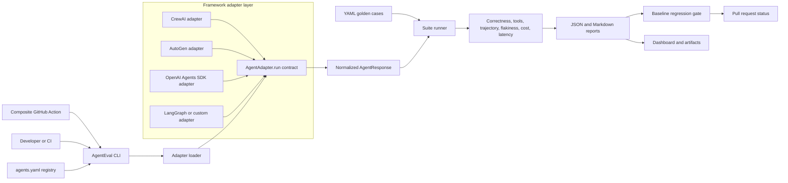

# AgentEval

[](https://github.com/nishanttyagi28/agenteval/actions/workflows/eval.yml)
[](https://pypi.org/project/nishanttyagi-agenteval/)
[](https://pypi.org/project/nishanttyagi-agenteval/)
[](LICENSE)

**CI evaluation for LLM agents: golden cases, trajectory evidence, flakiness analysis, cost and latency tracking, and regression gates.**

[**View the live AgentEval demo →**](https://nishanttyagi28.github.io/agenteval/)

AgentEval gives agent teams a repeatable answer to a difficult release question: _did this change make the agent better, worse, or merely different?_ It runs versioned YAML cases through a framework adapter, normalizes the evidence, scores the result, and turns regressions into an auditable CI decision.

## Why AgentEval

Agents fail differently from deterministic software. The final answer can look reasonable while the agent called the wrong tool, followed a degraded path, became flaky, doubled its cost, or silently skipped a case. AgentEval makes those behaviors testable without replacing ordinary unit tests.

| Capability | AgentEval | Manual spot checks | Custom eval scripts |
|---|:---:|:---:|:---:|
| Versioned golden cases | ✅ | ❌ | ⚠️ You build it |
| Correctness and hallucination scoring | ✅ | Subjective | ⚠️ You build it |
| Tool-call and trajectory evidence | ✅ | Easy to miss | ⚠️ Framework-specific |
| Flakiness detection | ✅ | Impractical | ⚠️ You build it |
| Cost and latency tracking | ✅ | Rarely captured | ⚠️ Provider-specific |
| Baseline regression gate | ✅ | ❌ | ⚠️ You maintain it |
| JSON and Markdown reports | ✅ | ❌ | ⚠️ You build it |
| Reusable GitHub Action | ✅ | ❌ | ⚠️ You maintain it |

## Architecture



The adapter boundary is deliberately small: every framework returns the same `AgentResponse` fields—output, tool calls, fired nodes, token usage, cost, latency, and JSON-safe raw evidence. The runner and scoring layers therefore remain framework-independent.

## Installation

AgentEval supports Python 3.10 and newer.

```bash
python -m pip install nishanttyagi-agenteval
agenteval --help
```

Install only the framework integration you need:

```bash
python -m pip install "nishanttyagi-agenteval[crewai]"
python -m pip install "nishanttyagi-agenteval[autogen]"
python -m pip install "nishanttyagi-agenteval[openai-agents]"
```

The distribution is named `nishanttyagi-agenteval`; the Python package and command are both named `agenteval`.

## Quickstart

1. Add a golden suite:

```yaml
# tests/golden/research.yaml
- id: cite_primary_source
  prompt: "Summarize the launch date from the primary source."
  expects:
    correctness_type: contains
    ground_truth: "July 18"
    must_call_tools: [web_search]
    must_not_hallucinate: true
    expected_trajectory: ["agent:researcher", "agent:writer"]
  tags: [research, smoke]
```

2. Register the agent and adapter:

```yaml
# agents.yaml
version: 1
agents:
  research_crew:
    display_name: Research crew
    enabled: true
    adapter: agenteval.adapters.crewai:CrewAIAdapter
    repository:
      env_var: RESEARCH_CREW_PATH
      default_path: .
      required_paths: [src/research_crew/crew.py]
    golden_suite: tests/golden/research.yaml
    baseline: baselines/research_crew.json
    runs_dir: runs/research_crew
    adapter_options:
      crew_import: research_crew.crew:ResearchCrew
      input_key: topic
    gates:
      max_correctness_drop: 0.05
      max_hallucination_rate: 0.10
      min_tool_accuracy: 0.90
      fail_on_evaluator_error: true
      fail_on_agent_error: true
    smoke_case_ids: [cite_primary_source]
```

3. Run and compare:

```bash
export RESEARCH_CREW_PATH="$PWD"
agenteval run --agent research_crew --no-llm-judge
agenteval compare --agent research_crew
```

Use `--case-id`, `--tag`, and `--runs-dir` to narrow or relocate a run. Both `agenteval` and `python -m agenteval` invoke the same CLI.

## Supported frameworks

| Framework | Support | Adapter entry point | Captured evidence |
|---|---|---|---|
| [CrewAI](https://docs.crewai.com/) | First-party adapter | `agenteval.adapters.crewai:CrewAIAdapter` | Tasks, agents, tools, usage, cost, output |
| [Microsoft AutoGen](https://microsoft.github.io/autogen/stable/) | First-party adapter | `agenteval.adapters.autogen:AutoGenAdapter` | Agent messages, tools, trajectory, usage, cost, output |
| [OpenAI Agents SDK](https://openai.github.io/openai-agents-python/) | First-party adapter | `agenteval.adapters.openai_agents:OpenAIAgentsAdapter` | Run items, tools, handoffs, usage, cost, output |
| [LangGraph](https://langchain-ai.github.io/langgraph/) | Contract-native | Custom `AgentAdapter` around the compiled graph | Graph state, tool calls, nodes, usage, output |
| Any Python agent | Stable public contract | Subclass `agenteval.adapters.base.AgentAdapter` | Any evidence mapped to `AgentResponse` |

> LangGraph uses the public adapter contract in this release; a dedicated `LangGraphAdapter` module is not claimed or required. This distinction keeps the compatibility statement accurate.

All integrations are optional at import time. A repository can run AgentEval's core without installing every agent framework.

### Microsoft AutoGen

AutoGen's AgentChat `run(task=...)` method is asynchronous. The adapter preserves AgentEval's synchronous contract and safely handles normal scripts, notebooks, and applications that already have an event loop.

```python
from agenteval.adapters import AutoGenAdapter

adapter = AutoGenAdapter(
    agent_factory=build_fresh_autogen_agent,
    input_cost_per_million=2.50,
    output_cost_per_million=10.00,
)
result = adapter.run("Research the release notes")
```

Use `agent_factory` or `agent_import` for isolated state per golden case. A direct `agent` instance intentionally retains AutoGen's documented conversation state.

### OpenAI Agents SDK

```python
from agenteval.adapters import OpenAIAgentsAdapter

adapter = OpenAIAgentsAdapter(
    agent_factory=build_fresh_openai_agent,
    run_options={"max_turns": 8},
)
result = adapter.run("Check the deployment evidence")
```

The adapter uses `Runner.run_sync` in ordinary synchronous code and `Runner.run` through a safe bridge when an event loop is already active. Provider failures propagate to the runner and are recorded as agent errors rather than successful answers.

## Reusable GitHub Action

This repository contains a root composite action. After a stable `v1` tag is published, consume it from another repository with:

```yaml
steps:
  - uses: actions/checkout@v4
  - name: Run AgentEval
    id: agenteval
    uses: nishanttyagi28/agenteval@v1
    with:
      agent: research_crew
      config-file: agents.yaml
      agent-path: .
      cases-file: tests/golden/research.yaml
      runs-dir: .agenteval/runs
      install-extras: crewai
      no-llm-judge: "true"
  - uses: actions/upload-artifact@v4
    if: always() && steps.agenteval.outputs.report-path != ''
    with:
      name: agenteval-report
      path: |
        ${{ steps.agenteval.outputs.report-path }}
        ${{ steps.agenteval.outputs.comparison-path }}
```

Inputs cover the registered agent, registry, agent path, case and baseline overrides, case IDs, tags, framework extras, and gate behavior. Outputs are `passed`, `report-path`, and `comparison-path`. See the complete [consumer workflow](examples/github-actions/agenteval.yml).

GitHub resolves actions as `owner/repository@ref`. The requested coordinate `nishanttyagi28/agenteval-action@v1` would require a separate repository with that exact name; it does not currently exist. The action maintained in this repository is therefore correctly addressed as `nishanttyagi28/agenteval@v1`.

## Scoring and regression gates

| Signal | How AgentEval evaluates it |
|---|---|
| Correctness | Exact, contains, numeric, numeric-table, or optional LLM-judge scoring |
| Hallucination | Unsupported numeric or factual claims against deterministic ground truth |
| Tool accuracy | Required and observed tool-call precision and recall |
| Trajectory | Longest-common-subsequence evidence over expected and actual nodes |
| Latency | Per-case wall time plus suite p50 and p95 |
| Cost | Provider-reported cost or explicit token-rate calculation; character estimate fallback |

Execution failures (`agent_error`) and evaluator failures (`evaluator_error`) are separate from incorrect answers and fail the gate by default. Missing or skipped baseline cases also fail loudly, preventing incomplete runs from appearing healthy.

## Flakiness detection

Repeat only explicitly selected cases to avoid unexpectedly multiplying provider spend:

```bash
agenteval run \
  --agent research_crew \
  --repeat 5 \
  --repeat-case cite_primary_source
```

The primary observation plus repeated observations produce a consistency fraction and `stable`, `flaky`, or `unstable` classification. Flakiness evidence is stored separately under `runs/<agent>/flakiness/` and is currently observability-only.

## Reports and dashboard

Every run stores case-level output, scoring evidence, tool calls, trajectory, usage, latency, cost, and provenance as JSON. `agenteval compare` also emits machine-readable JSON and review-friendly Markdown.

```bash
python -m streamlit run dashboard/app.py
```

The dashboard provides run summaries, regression trade-offs, trajectory evidence, and case drill-down. The static [live demo](https://nishanttyagi28.github.io/agenteval/) shows the project workflow without executing an agent or making API calls.

## Development

```bash
git clone https://github.com/nishanttyagi28/agenteval.git
cd agenteval
python -m venv .venv
python -m pip install -e ".[dev]"
python -m pytest -q
```

Landing-page checks run separately:

```bash
cd landing-page
npm ci
npx playwright install chromium
npm test
```

See [CONTRIBUTING.md](CONTRIBUTING.md) for environment setup, test commands, adapter expectations, and pull-request guidance.

## Project layout

```text
adapters/                 Framework adapters and AgentAdapter contract
core/                     Runner, scoring, comparison, storage, and provenance
dashboard/                Streamlit evidence dashboard
landing-page/             Static product site and Playwright tests
tests/                    Deterministic Python test suite
action.yml                Reusable composite GitHub Action
.github/workflows/        CI, action smoke test, Pages, and PyPI publishing
agents.yaml               Agent registry and gate configuration
```

## License

AgentEval is available under the [MIT License](LICENSE).

Built by [Nishant Tyagi](https://github.com/nishanttyagi28).
