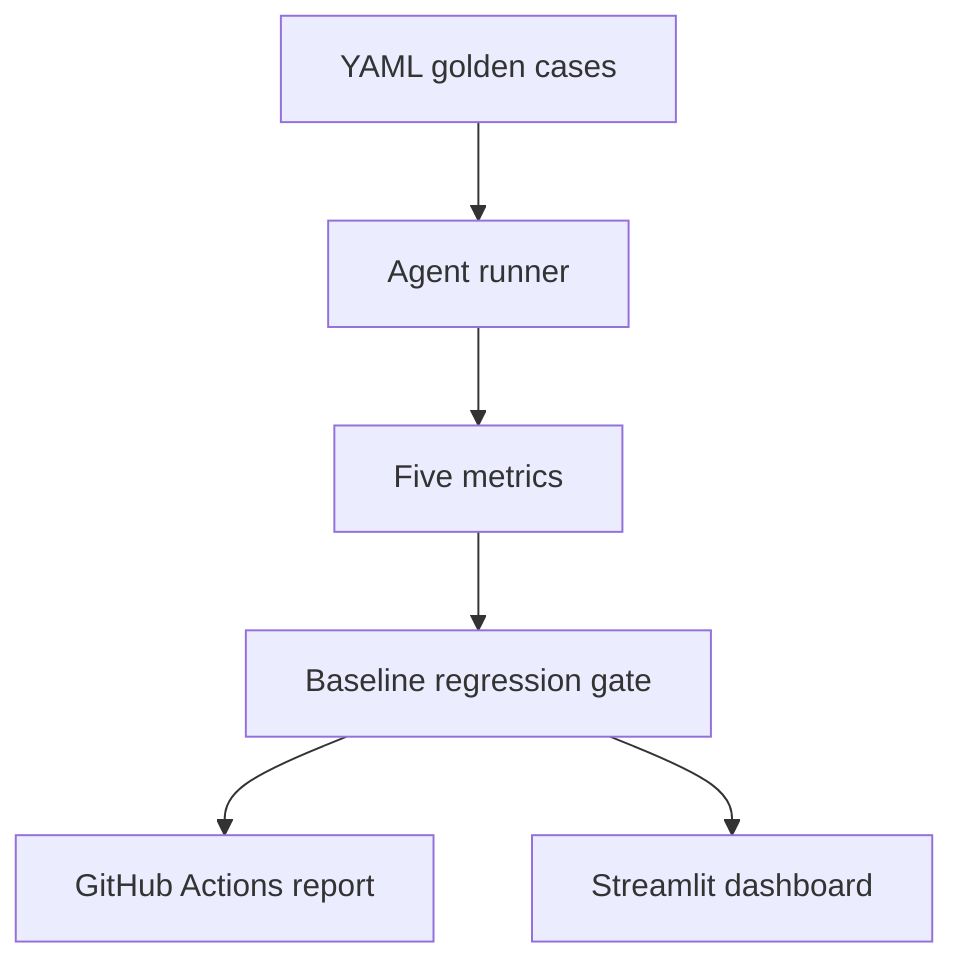
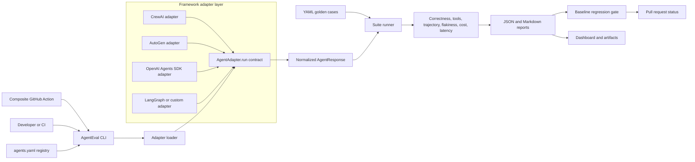

# AgentEval

[](https://github.com/nishanttyagi28/agenteval/actions/workflows/eval.yml)
[](https://pypi.org/project/nishanttyagi-agenteval/)
[](https://pypi.org/project/nishanttyagi-agenteval/)
[](LICENSE)
[](pyproject.toml)
[](https://agenteval-6honbe24hradazngswxkrq.streamlit.app/)

**CI for AI agents — pytest and GitHub Actions style evaluation for LLM systems.**

AgentEval runs an agent against YAML golden suites, scores five reliability metrics, compares results with a versioned baseline, and turns regressions into a reviewable CI decision.

**Catch broken answers, wrong tool choices, flaky behavior, and regressions before your AI agent reaches production.**

**[Explore the static AgentEval demo](https://nishanttyagi28.github.io/agenteval/)**

**[Open the live dashboard](https://agenteval-6honbe24hradazngswxkrq.streamlit.app/)**

The static demo explains the workflow without executing an agent or making API calls. The Streamlit dashboard presents stored evaluation evidence and historical runs.

## Table of contents

- [Why AgentEval](#why-agenteval)
- [Evaluation flow](#evaluation-flow)
- [Architecture](#architecture)
- [Five metrics](#five-metrics)
- [Failure taxonomy and gate integrity](#failure-taxonomy-and-gate-integrity)
- [Budget and latency gates](#budget-and-latency-gates)
- [Flakiness detection](#flakiness-detection)
- [Trajectory scoring](#trajectory-scoring)
- [RAG evaluation mode](#rag-evaluation-mode)
- [Trace viewer](#trace-viewer)
- [Cost attribution](#cost-attribution)
- [Regression alerting](#regression-alerting)
- [Calibrated LLM-as-judge](#calibrated-llm-as-judge)
- [Regression suites from production failures](#regression-suites-from-production-failures)
- [Cross-run statistical significance](#cross-run-statistical-significance)
- [Golden case example](#golden-case-example)
- [Dashboard evidence](#dashboard-evidence)
- [Installation](#installation)
- [Getting started with `agenteval init`](#getting-started-with-agenteval-init)
- [Quickstart with Agentic Data Analyst](#quickstart-with-agentic-data-analyst)
- [Supported frameworks](#supported-frameworks)
- [CrewAI adapter](#crewai-adapter)
- [Microsoft AutoGen adapter](#microsoft-autogen-adapter)
- [OpenAI Agents SDK adapter](#openai-agents-sdk-adapter)
- [LangGraph adapter](#langgraph-adapter)
- [GitHub Actions](#github-actions)
- [Adversarial robustness](#adversarial-robustness)
- [Dataset import and case generation](#dataset-import-and-case-generation)
- [HTML reports and regression trend tracking](#html-reports-and-regression-trend-tracking)
- [Model/provider comparison](#modelprovider-comparison)
- [VS Code extension](#vs-code-extension)
- [Documentation site (scaffold, not deployed)](#documentation-site-scaffold-not-deployed)
- [Project structure](#project-structure)
- [Testing](#testing)
- [Current limitations](#current-limitations)
- [Contributing](#contributing)
- [License](#license)

## Why AgentEval

LLM agents are probabilistic. A prompt, model, or tool change can improve one answer while silently reducing correctness elsewhere, increasing hallucinations, or raising latency and cost. Traditional unit tests remain useful for deterministic code, but they do not fully cover model outputs, tool routing, or quality drift across versions.

AgentEval adds the missing evaluation layer:

- YAML-defined golden test cases
- deterministic-first scoring with an LLM judge only for open-ended answers
- baseline comparison and configurable regression gates
- explicit agent, evaluator, missing-case, and skipped-case failures
- opt-in repeat consistency evidence for flaky outputs
- optional LCS-based trajectory evidence for expected agent steps
- a Streamlit dashboard for summary, regression, and case-level inspection
- GitHub Actions automation with a six-case smoke suite and optional 21-case full suite
- reviewable adversarial variants that remain outside blocking CI until approved

| Capability | AgentEval | Manual spot checks | Custom eval scripts |
|---|:---:|:---:|:---:|
| Versioned golden cases | ✅ | ❌ | ⚠️ You build it |
| Correctness and hallucination scoring | ✅ | Subjective | ⚠️ You build it |
| Tool-call and trajectory evidence | ✅ | Easy to miss | ⚠️ Framework-specific |
| Flakiness detection | ✅ | Impractical | ⚠️ You build it |
| Cost and latency tracking | ✅ | Rarely captured | ⚠️ Provider-specific |
| Baseline regression gate | ✅ | ❌ | ⚠️ You maintain it |
| JSON and Markdown reports | ✅ | ❌ | ⚠️ You build it |
| Reusable GitHub Action | ✅ | ❌ | ⚠️ You maintain it |

## Evaluation flow



1. Define the prompt, ground truth, required tools, and tolerance in YAML.
2. Run each case through an adapter for the agent under test.
3. Score the output and store a provenance-linked JSON run.
4. Compare the current report with a versioned baseline.
5. Fail CI when configured quality gates or case-integrity checks are violated.
6. Inspect suite and case-level evidence in the dashboard.

## Architecture



Every framework adapter returns the same `AgentResponse` fields: output, tool calls, fired nodes, token usage, cost, latency, retrieved context/citations (for [RAG evaluation](#rag-evaluation-mode)), and JSON-safe raw evidence. The runner, scoring, comparison, and reporting layers therefore remain framework-independent.

## Five metrics

| Metric | What it evaluates | Implementation |
|---|---|---|
| **Correctness** | Whether the answer matches the expected result | Exact, contains, numeric, numeric-table, or LLM-judge checks |
| **Hallucination rate** | Unsupported numeric or factual claims | Deterministic ground-truth comparison |
| **Tool-call accuracy** | Whether the required tools were invoked | Precision, recall, and suite-level F1 |
| **Latency** | Response-time distribution | p50 and p95 wall-clock latency |
| **Cost** | Estimated or provider-reported usage cost | Per-case and suite-level USD estimate |

Correctness uses the exact tolerance configured in YAML. Hallucination detection applies a separate minimum absolute tolerance of 0.01 for harmless numeric formatting noise; that floor cannot convert an incorrect answer into a correctness pass.

Every scored run also aggregates `total_tokens` (prompt + completion tokens summed across cases, `null` when no case reports token usage) alongside `total_cost_usd` — it feeds the opt-in token-spike gate below and appears as a metric delta anywhere the other five do.

## Failure taxonomy and gate integrity

AgentEval distinguishes output quality from execution and evaluation failures:

| Status | Meaning | Quality denominators | Default gate behaviour |
|---|---|---:|---|
| `failed` | The agent ran but failed an expectation | Included | Can fail metric gates |
| `agent_error` | Provider, ingestion, SQL, adapter, or execution failure | Excluded | Fails loudly |
| `evaluator_error` | The evaluator or LLM judge could not produce a valid decision | Excluded | Fails loudly |
| `skipped` | A case produced no scored result | Excluded | Fails loudly |
| `missing` | A baseline case is absent from the current run | Not applicable | Fails loudly |

Infrastructure failures are not counted as incorrect or hallucinated answers, so provider outages do not corrupt quality rates. They remain visible and fail the regression gate by default. Missing and skipped cases are also gated to prevent an incomplete run from appearing healthy.

## Budget and latency gates

Beyond the always-on correctness/hallucination/tool-accuracy gates, three additional safety
gates extend the same baseline/compare system and are **opt-in** — each defaults to `null`
(disabled), so existing `agents.yaml` files and `agenteval compare` invocations see no behavior
change until configured:

```yaml
gates:
  max_cost_increase_pct: 20      # fail if total_cost_usd rises more than 20% over baseline
  max_latency_p95_ms: 3000       # fail if the current run's p95 latency exceeds 3000ms
  max_token_increase_pct: 50     # fail if total_tokens rises more than 50% over baseline
```

Or per-invocation via `agenteval compare` flags, which override the registry's configured
values exactly like the existing `--max-correctness-drop`/`--max-hallucination-rate`/
`--min-tool-accuracy` overrides:

```bash
agenteval compare --max-cost-increase-pct 20 --max-latency-p95-ms 3000 --max-token-increase-pct 50
```

Once a gate is enabled, missing metric data (for example a baseline recorded before
`total_tokens` was tracked) fails the gate loudly rather than silently passing — the same
"fail loudly on missing data" principle the existing correctness/hallucination/tool-accuracy
gates already follow. A zero-cost or zero-token baseline with any positive current value is
treated as a real increase rather than skipped via division-by-zero avoidance.

## Flakiness detection

LLM agents can produce different answers for the same prompt even when the code and inputs have not changed. AgentEval's opt-in repeat mode separates two different problems: an agent can be **consistently wrong** (the same failing verdict every time) or **flaky** (the verdict or comparable numeric value changes across observations). The report stores both consistency and pass rate so repeatability is never mistaken for correctness.

Run the normal suite once and repeat only explicitly selected cases:

```bash
agenteval run \
  --agent agentic_data_analyst \
  --repeat 5 \
  --repeat-case total_customers \
  --repeat-case avg_monthly_charges
```

`--repeat 5` means five total observations for each selected case: the primary suite result plus four additional invocations. Requiring explicit `--repeat-case` values prevents an accidental N-times increase in API calls across the full suite. The default `--repeat 1` follows the existing single-pass path without creating flakiness evidence.

| Classification | Consistency score |
|---|---:|
| `stable` | `1.0` |
| `flaky` | `0.80` to `<1.0` |
| `unstable` | `<0.80` |

These labels are documented defaults rather than information-losing buckets: every artifact retains the raw consistency fraction, such as `4/5`, so thresholds can be adjusted later.

Scalar numeric cases use `largest_complete_link_cluster`. Values cluster when the difference between the cluster maximum and minimum remains within the case's existing `numeric_tolerance`; the largest same-verdict cluster wins, and the primary observation receives no special preference. Exact, contains, and LLM-judge cases use verdict consistency. Ambiguous scalar numeric answers and numeric-table cases also fall back to verdict-only consistency.

Flakiness is observability-only in this phase. It does not affect the regression gate or baseline comparison. Evidence is stored separately under `runs/<agent>/flakiness/<run_id>.json`, keeping repeated latency, cost, answers, and verdicts isolated from the primary run report.

## Trajectory scoring

Trajectory scoring adds step-level evidence about how an agent reached its answer. A golden case can optionally declare the expected ordered events alongside its existing output expectations:

```yaml
- id: total_customers
  prompt: "How many customers are in the dataset?"
  expects:
    correctness_type: numeric
    ground_truth: 7043
    expected_trajectory: ["route:sql", "agent:sql"]
```

AgentEval compares `expected_trajectory` with the adapter's actual `nodes_fired` sequence using a longest common subsequence (LCS). The matched subsequence produces precision (matched steps divided by actual steps), recall (matched steps divided by expected steps), and their F1 score, while preserving evidence about exact match, ordering, missing steps, and extra steps. Duplicate steps retain their multiplicity.

The field is optional and backward compatible: cases without it are scored and serialized exactly as before. Trajectory scoring is observability-only in v1 and does not affect correctness, existing metrics, baseline comparison, or CI gates.

## RAG evaluation mode

For retrieval-augmented agents, AgentEval scores five additional optional metrics whenever an
adapter response carries retrieved context — **context relevance**, **faithfulness** (is the
answer grounded in the retrieved context), **citation correctness**, **retrieval precision/
recall**, and **unsupported-claim detection**. These integrate directly into the existing
metric system rather than a parallel one: they reuse the same set-based precision/recall
(`tool_call_precision_recall`) already used for tool-call accuracy, and the same numeric-claim
extraction already used for hallucination detection — applied against retrieved context instead
of ground truth. Like flakiness and trajectory scoring, this is **observability-only** and does
not affect correctness, the five core metrics, or the baseline regression gate.

An adapter opts in simply by populating `retrieved_context`/`citations` on its `AgentResponse`:

```python
return AgentResponse(
    output=answer,
    retrieved_context=[{"id": "doc1", "text": "Tokyo is the capital of Japan."}],
    citations=["doc1"],
)
```

A golden case can optionally declare RAG-specific ground truth alongside its existing
expectations — all fields are optional and backward compatible; cases without them are scored
exactly as before:

```yaml
- id: capital_of_japan
  prompt: "What is the capital of Japan?"
  expects:
    correctness_type: contains
    ground_truth: "Tokyo"
    relevant_context_ids: [doc1]      # ground truth for retrieval precision/recall
    expected_citations: [doc1]        # ground truth for citation correctness
    reference_context:                # fallback context, used only if the adapter
      - "Tokyo is the capital of Japan."   # itself returns no retrieved_context
```

`reference_context` lets a case test faithfulness/context-relevance in isolation from a live
retriever (e.g. testing the generation step alone). Citation correctness falls back to a
structural check — is every cited id actually present in retrieved context — when no
`expected_citations` ground truth is given. Suite-level averages (`context_relevance_avg`,
`faithfulness_avg`, `unsupported_claim_rate_avg`, `citation_f1_avg`, `retrieval_f1_avg`) appear
on the run report whenever at least one case produced a RAG evaluation, `null` otherwise.

## Trace viewer

Every run can carry a structured, step-by-step execution trace — tool calls, reasoning steps, or
graph nodes, each with its input/output, timing, and (optionally) per-step cost. Like flakiness,
trajectory, and RAG scoring, this is **observability-only** and additive: an adapter that reports
nothing here scores and serializes exactly as before this existed.

An adapter opts in by populating `trace_steps` on its `AgentResponse`:

```python
return AgentResponse(
    output=answer,
    trace_steps=[
        {"kind": "tool_call", "name": "search", "input": "capital of Japan", "output": "Tokyo", "duration_ms": 210.5},
        {"kind": "reasoning", "name": "synthesize", "output": "Tokyo is the capital of Japan."},
    ],
)
```

Replay a case's trace as text, or write a self-contained HTML page:

```bash
agenteval trace runs/20260723T120000Z_abc1234.json --case-id capital_of_japan
agenteval trace runs/20260723T120000Z_abc1234.json --case-id capital_of_japan --html trace.html
```

The replay marks any step that trajectory scoring (`expected_trajectory`) flagged as unexpected,
and lists any expected steps that never executed — pinpointing the exact step a case diverged at
rather than just the pass/fail outcome.

## Cost attribution

Cost estimation now looks up per-model USD/1M-token pricing (`core/pricing.py`) instead of a
single hardcoded rate, while staying fully backward compatible — omitting the model (as every
existing caller does) preserves the original Groq-only pricing exactly. The model is read from
the same `raw["_llm_usage"]["model"]` convention `agentic_data_analyst` already populates, so
model-aware costing works with zero adapter changes.

When an adapter reports per-step usage via `trace_steps` (see above), the HTML report's
**Cost breakdown** section shows cost attributed down to an individual tool call; otherwise it
shows a quiet empty-state message. Whole-run and per-case cost were already in the report and are
unchanged.

## Regression alerting

An optional webhook alert fires when the regression gate (`agenteval compare`) fails — Slack- and
Discord-compatible, no new dependency (stdlib `urllib`). It builds directly on the existing gate
decision (`ComparisonResult`) rather than a parallel notification path, and never touches the CI
workflow's PR-comment posting.

Opt in per agent in `agents.yaml` — the webhook URL itself is never stored in YAML, only the name
of an environment variable to read it from:

```yaml
agents:
  my_agent:
    alerting:
      enabled: true
      webhook_url_env: MY_AGENT_SLACK_WEBHOOK   # URL comes from this env var, not the file
      kind: slack                               # or "discord"
```

An agent that doesn't set `alerting` behaves exactly as before — no output, no webhook calls. A
failed send is reported (`alert=error: ...`) but never changes the gate's own exit code.

## Calibrated LLM-as-judge

`llm_judge` correctness cases are only as trustworthy as the judge's agreement with a human
reviewer. `agenteval calibrate` measures that agreement directly, using **Cohen's kappa** — the
standard statistic for inter-rater agreement, chosen over raw percent-agreement because it
corrects for the agreement two raters would reach by chance alone (a judge that always says
"pass" can look 90% accurate on a golden set that's 90% correct answers, with zero real
agreement). Interpreted against the Landis & Koch (1977) scale (`poor` / `slight` / `fair` /
`moderate` / `substantial` / `almost perfect`), the same reference most published inter-rater
agreement studies use.

A calibration set is a distinct, simpler shape than a golden `TestCase` — no agent is invoked.
Each entry already fixes a candidate answer and a human verdict on it:

```yaml
- id: calib_wrong_number
  prompt: "How many customers churned?"
  ground_truth: 7
  candidate_answer: "9 customers churned."
  human_label: false
```

See `tests/golden/calibration_example.yaml` for a small worked example with a deliberate mix of
agreements and disagreements — an all-agree fixture can't tell a well-calibrated judge apart from
one that just says "pass" unconditionally.

```bash
agenteval calibrate --judge agentic_data_analyst --golden-set tests/golden/calibration_example.yaml
```

`--judge <name>` is a registered agent name (the same registry every other `--agent` flag uses),
because the judge implementation is tied to whichever sibling repository's LLM client that agent
resolves to — there's no separate pluggable judge abstraction. The command exits non-zero and
prints a warning when kappa falls below `--kappa-threshold` (default 0.6, "substantial"
agreement), and lists every case where the judge and the human disagreed.

**Limitation:** kappa on a small calibration set is itself noisy — treat it as a directional
signal, not a certified score, until the set has enough cases (and enough disagreement variety)
to be representative of the judge's real failure modes.

## Regression suites from production failures

`agenteval generate-cases --from-failures` mines *targeted* regression cases from a baseline vs.
current run pair, instead of trusting an arbitrary log line. Only a case where baseline **passed**
and current **failed or errored** qualifies — for exactly that case, the baseline's own
`final_answer` is trustworthy ground truth (it already passed correctness), which is what makes
this safer than treating any surviving answer as ground truth regardless of whether it was ever
verified correct.

```bash
agenteval generate-cases --from-failures \
  --baseline runs/baseline.json --current runs/latest.json \
  --output tests/adversarial/regressions.yaml
```

Near-duplicate failures are clustered by `difflib.SequenceMatcher` similarity over a normalized
error/answer signature (`--similarity-threshold`, default `0.85`) so ten instances of the same
underlying outage don't produce ten redundant candidates — one candidate per cluster, tagged with
`cluster_size:N`. Every candidate carries `review_status: candidate` and is import-compatible with
`agenteval import`/the existing `generate-cases --logs` output, same as Tier 4.

## Cross-run statistical significance

A correctness-rate drop between two runs can be a real regression or ordinary run-to-run noise —
`core/significance.py` answers that question directly for paired binary outcomes (same case,
baseline vs. current), rather than eyeballing a percentage delta.

**McNemar's test** is the standard method for this exact shape of data: it looks only at
*discordant* pairs (cases that flipped from pass to fail, or fail to pass) since agreement pairs
carry no information about change. Below 25 discordant pairs (the standard rule of thumb) it uses
the **exact binomial** variant; above that, the continuity-corrected **asymptotic chi-square**
test. Both are exact closed-form math — no scipy/numpy dependency was needed:
a chi-square distribution with 1 degree of freedom is *exactly* the distribution of a squared
standard normal, so its survival function is `math.erfc(sqrt(x/2))`, not an approximation; the
exact binomial tail uses `math.comb`. A **percentile bootstrap confidence interval** on the
correctness-rate delta rounds this out for cases where a single p-value is less intuitive than a
range.

```bash
agenteval compare --agent my_agent --require-statistical-significance --significance-alpha 0.05
```

This is fully **opt-in** — every existing `agenteval compare` invocation and `agents.yaml` behaves
exactly as before. When enabled, a correctness drop that exceeds the normal threshold gate is only
treated as a real regression if McNemar's test finds it significant; an insignificant drop is
reported as noise and does not fail the gate. If significance can't be verified at all (e.g. no
overlapping case IDs between the two runs), the gate **fails safe** — it keeps the original
threshold-based reason rather than silently passing an unverifiable drop.

`agenteval compare`'s output, `format_markdown`, and the HTML report all show a plain-language
verdict (e.g. *"not statistically significant (p=0.32 ≥ alpha=0.05): within normal run-to-run
variation"*), not just the raw statistic.

**Limitations, stated explicitly:**
- Both McNemar variants need paired cases with a determinate boolean verdict in *both* runs;
  cases that errored, were skipped, or don't exist in one of the two runs are excluded, not
  imputed.
- Statistical power is genuinely low with few discordant pairs — the tool flags this (`< 10`
  discordant pairs, or `< 10` paired cases for the bootstrap) rather than reporting an
  overconfident p-value or a misleadingly narrow interval.
- "Not statistically significant" is not proof of "no real change" — it means the evidence doesn't
  clear the bar, which is a meaningfully different (and weaker) claim, especially on small suites.

## Golden case example

```yaml
- id: avg_tenure_months
  prompt: "What is the average tenure in months?"
  expects:
    correctness_type: numeric
    must_call_tools: [sql_agent]
    must_not_hallucinate: true
    ground_truth: 25.23
    numeric_tolerance: 0.05
```

The current analyst suite contains 21 hand-written cases grounded in the demonstration dataset.

## Dashboard evidence

AgentEval is integrated with [Agentic Data Analyst](https://github.com/nishanttyagi28/agentic-data-analyst), a modular application that routes natural-language questions to SQL, ML, statistics, forecasting, reporting, and RAG components.

### Historical run summary


The screenshot records a specific historical run; it is evidence from that run, not a claim about the current deployment state.

### Regression trade-off


The comparison view exposes trade-offs instead of collapsing health into one number. In the recorded example, correctness improved from 85.7% to 95.2%, while p95 latency and estimated cost both increased.

### Failure drill-down


A numeric answer of approximately 25 months failed against a ground truth of 25.23 with a tolerance of 0.05. The ground truth was intentionally preserved rather than loosened to produce a green result.

## Installation

Install the published package from PyPI:

```bash
python -m pip install nishanttyagi-agenteval
agenteval --help
```

Install only the framework integration you need:

```bash
python -m pip install "nishanttyagi-agenteval[crewai]"
python -m pip install "nishanttyagi-agenteval[autogen]"
python -m pip install "nishanttyagi-agenteval[openai-agents]"
```

The PyPI distribution is named `nishanttyagi-agenteval`, while the Python package and console command remain `agenteval`:

```python
import agenteval
```

Both `agenteval ...` and `python -m agenteval ...` invoke the same CLI. For contributors working from a clone, use an editable install instead:

```bash
git clone https://github.com/nishanttyagi28/agenteval
cd agenteval
python -m pip install -e .
python -m pip install -r requirements-dev.txt
```

Alternatively, install the repository's development extra with `python -m pip install -e ".[dev]"`.

### Docker

A minimal `Dockerfile` at the repository root packages the CLI as a runnable container:

```bash
docker build -t agenteval .
docker run --rm agenteval --help
docker run --rm agenteval run --agent action_demo --registry examples/action_demo/agents.yaml
```

The image is `python:3.12-slim`-based (pandas ships prebuilt wheels for glibc, avoiding a
compiler toolchain), installs only the package's own runtime dependencies, and runs as a
non-root user. `scripts/docker_smoke_test.sh` builds the image and verifies both `--help` and a
fully self-contained sample evaluation (`examples/action_demo` — zero API key, zero external
repo) succeed inside the container; the `Docker image` GitHub Actions workflow runs the same
check in CI. Mount a registry and agent repository as volumes to evaluate your own agent:

```bash
docker run --rm -v "$PWD:/workspace" -w /workspace agenteval run --agent my_agent
```

## Getting started with `agenteval init`

For a brand-new project, `agenteval init` scaffolds everything needed for a first evaluation:

```bash
cd my-agent-project
agenteval init --agent-name my_agent
```

It auto-detects the framework in the current directory (CrewAI, LangGraph, Microsoft AutoGen,
or the OpenAI Agents SDK — checked against `requirements.txt`/`pyproject.toml` and a bounded
scan of imports) and generates:

- `agents.yaml` — a registry entry wired to the matching first-party adapter, with
  `adapter_options` placeholders to fill in (e.g. `crew_import`, `agent_import`, `graph_import`)
- `tests/golden/<agent_name>.yaml` — a small sample golden suite (`exact`, `numeric`, and
  `contains` cases) ready to edit with real prompts and expectations
- `.github/workflows/agenteval.yml` — a PR-triggered workflow consuming the reusable
  `nishanttyagi28/agenteval@v1` composite action

When no supported framework is detected, `init` still scaffolds all three files: the registry
entry points at the base `agenteval.adapters.base:AgentAdapter` contract and is written as
`enabled: false` until you subclass it and flip it on — this never fails the scaffold itself.

Useful flags:

```bash
agenteval init --path ./my-agent-project --agent-name my_agent --framework auto
agenteval init --framework langgraph          # skip detection, force a framework
agenteval init --force                        # overwrite a previous scaffold
agenteval init --run                          # attempt a first `agenteval run` afterward
```

`--run` is best-effort: a missing dependency, missing API key, or a still-disabled placeholder
adapter prints a clear `first-run skipped: ...` message instead of failing the scaffold.

## Quickstart with Agentic Data Analyst

Python 3.12 is used by the CI workflow.

```bash
mkdir agenteval-demo && cd agenteval-demo
git clone https://github.com/nishanttyagi28/agenteval
git clone https://github.com/nishanttyagi28/agentic-data-analyst
python -m pip install -e ./agenteval
python -m pip install -r agentic-data-analyst/requirements.txt

export AGENTIC_ANALYST_PATH="$PWD/agentic-data-analyst"

# Run all golden cases
agenteval run

# Compare a current report with the versioned baseline
agenteval compare \
  --baseline agenteval/baselines/data_analyst.json \
  --current agenteval/runs/<run>.json

# Launch the dashboard
python -m streamlit run agenteval/dashboard/app.py
```

The repositories may live anywhere when `AGENTIC_ANALYST_PATH` points to the Agentic Data Analyst checkout. Keeping them as siblings also supports the default local discovery path.

## Supported frameworks

All framework integrations are optional at import time, so AgentEval's core does not require every agent SDK.

| Framework | Support | Adapter entry point | Captured evidence |
|---|---|---|---|
| [CrewAI](https://docs.crewai.com/) | First-party adapter | `agenteval.adapters.crewai:CrewAIAdapter` | Tasks, agents, tools, usage, cost, output |
| [Microsoft AutoGen](https://microsoft.github.io/autogen/stable/) | First-party adapter | `agenteval.adapters.autogen:AutoGenAdapter` | Agent messages, tools, trajectory, usage, cost, output |
| [OpenAI Agents SDK](https://openai.github.io/openai-agents-python/) | First-party adapter | `agenteval.adapters.openai_agents:OpenAIAgentsAdapter` | Run items, tools, handoffs, usage, cost, output |
| [LangGraph](https://langchain-ai.github.io/langgraph/) | First-party adapter | `agenteval.adapters.langgraph:LangGraphAdapter` | Node execution path, retries, state transitions, tool calls, usage, output |
| Any Python agent | Stable public contract | Subclass `agenteval.adapters.base.AgentAdapter` | Any evidence mapped to `AgentResponse` |

## CrewAI adapter

Install the optional CrewAI integration and wrap either an existing crew or a
factory that creates fresh crew state for each evaluation case:

```bash
python -m pip install -e ".[crewai,dev]"
```

```python
from agenteval.adapters import CrewAIAdapter

adapter = CrewAIAdapter(
    crew_factory=lambda: LatestAiDevelopmentCrew().crew(),
    input_key="topic",
    inputs={"audience": "engineering leaders"},
)
response = adapter.run("AI agent reliability")
```

To use a standard CrewAI `CrewBase` project through `agenteval run`, point a
registry entry at the adapter and name the importable crew class. AgentEval
adds both the configured repository root and its conventional `src/` directory
to the import path:

```yaml
adapter: agenteval.adapters.crewai:CrewAIAdapter
repository:
  env_var: MY_CREW_PATH
  default_path: ../my-crew
  required_paths: [src/my_crew/crew.py]
adapter_options:
  crew_import: my_crew.crew:MyCrew
  input_key: topic
```

The adapter calls `crew.kickoff(inputs=...)` and normalizes the final raw
output, task and agent trajectory, observed tool calls, token usage, latency,
and JSON-safe execution evidence into the standard `AgentResponse`. Existing
crew-level step callbacks are chained and restored. CrewAI remains optional at
AgentEval import time; pass `crew_factory` when independent state per case is
important, or `crew` when the same instance should be reused.

## Microsoft AutoGen adapter

AutoGen's AgentChat `run(task=...)` method is asynchronous. The adapter preserves AgentEval's synchronous contract and safely handles ordinary scripts, notebooks, and applications that already have an event loop.

```python
from agenteval.adapters import AutoGenAdapter

adapter = AutoGenAdapter(
    agent_factory=build_fresh_autogen_agent,
    input_cost_per_million=2.50,
    output_cost_per_million=10.00,
)
response = adapter.run("Research the release notes")
```

Use `agent_factory` or `agent_import` for isolated state per golden case. A direct `agent` instance intentionally retains AutoGen's documented conversation state. Provider and network failures propagate to the runner so they are recorded as `agent_error` rather than successful answers.

For registry-driven CLI runs, configure the adapter with an importable agent or factory:

```yaml
adapter: agenteval.adapters.autogen:AutoGenAdapter
adapter_options:
  agent_import: my_autogen_project.agents:build_research_agent
  input_cost_per_million: 2.50
  output_cost_per_million: 10.00
```

## OpenAI Agents SDK adapter

The OpenAI Agents SDK adapter captures final output, tool calls, handoffs, agent trajectory, token usage, provider-reported or configured cost, latency, interruptions, and bounded JSON-safe run evidence.

```python
from agenteval.adapters import OpenAIAgentsAdapter

adapter = OpenAIAgentsAdapter(
    agent_factory=build_fresh_openai_agent,
    run_options={"max_turns": 8},
)
response = adapter.run("Check the deployment evidence")
```

The adapter uses `Runner.run_sync` in ordinary synchronous code and `Runner.run` through a safe bridge when an event loop is already active. Provider failures propagate to the runner and are recorded as `agent_error`.

For registry-driven CLI runs:

```yaml
adapter: agenteval.adapters.openai_agents:OpenAIAgentsAdapter
adapter_options:
  agent_import: my_agents.support:build_support_agent
  run_options:
    max_turns: 8
```

## LangGraph adapter

LangGraph mutates a shared state object across node executions rather than returning a single
chat completion, so the adapter drives the compiled graph's `stream(inputs, config=...,
stream_mode="updates")` contract and reconstructs the evidence AgentEval needs from that update
stream: node execution order (including repeats, so a node revisited in a cycle reads as a
retry), a best-effort merged final state, invoked tool names, and token usage summed off any
LangChain message objects seen in the deltas.

```python
from agenteval.adapters import LangGraphAdapter

adapter = LangGraphAdapter(
    graph_factory=build_fresh_graph,
    output_key="answer",
    input_cost_per_million=0.50,
    output_cost_per_million=1.50,
)
response = adapter.run("How many customers churned last quarter?")
```

`output_key` names the state key holding the final answer; without it, the adapter tries
`output`, `answer`, `response`, `result`, then the last AI-message content, then a stringified
state as a last resort. `input_key` (default `"messages"`) and `input_builder` control how the
prompt is shaped into the graph's input state. `raw` evidence includes `node_visit_counts`,
`retries` (nodes visited more than once), and `execution_path`.

For registry-driven CLI runs:

```yaml
adapter: agenteval.adapters.langgraph:LangGraphAdapter
adapter_options:
  graph_import: my_graph.app:build_graph
  output_key: answer
```

LangGraph itself remains optional at AgentEval import time — the adapter only duck-types the
`stream`/`invoke` surface, so it never imports the `langgraph` package directly.

## GitHub Actions

`.github/workflows/eval.yml` runs on pull requests and manual dispatch:

- deterministic unit tests and CLI validation run first
- an internal pull request or manual dispatch can run the live evaluation
- pull requests use six selected smoke cases
- manual dispatch with `full_suite=true` runs all 21 golden cases
- the current report is compared with the versioned baseline
- a self-contained HTML report (`agenteval report`) is generated alongside the JSON/Markdown comparison
- evidence — the run JSON, comparison JSON/Markdown, and HTML report — is uploaded as one workflow artifact
- a PR bot comment (PASS/FAIL, metric deltas, regressed cases, and a link to the workflow run holding the HTML report artifact) is created or updated on the pull request — identified by a stable per-agent HTML marker, so reruns update the same comment instead of posting a new one
- missing `GROQ_API_KEY` produces an explicit skipped-evaluation summary
- concurrency cancellation and job timeouts prevent stale or runaway runs

### Reusable composite action

The root `action.yml` lets another repository install AgentEval, run a registered agent, compare the report with its baseline, and expose the result to later workflow steps.

After a stable `v1` tag is published, consume the action with:

```yaml
name: AgentEval

on:
  pull_request:

permissions:
  contents: read

jobs:
  evaluate:
    runs-on: ubuntu-latest
    steps:
      - uses: actions/checkout@v5

      - name: Run AgentEval
        id: agenteval
        uses: nishanttyagi28/agenteval@v1
        with:
          agent: research_crew
          config-file: agents.yaml
          agent-path: .
          cases-file: tests/golden/research.yaml
          baseline-file: baselines/research_crew.json
          runs-dir: .agenteval/runs
          install-extras: crewai
          no-llm-judge: "true"
```

Supported inputs include the registered agent, registry path, agent repository path, golden-case and baseline overrides, run directory, case IDs, tags, framework extras, Python version, LLM-judge behavior, and regression-failure behavior. The action exposes `passed`, `report-path`, `comparison-path`, `comparison-markdown-path`, and `html-report-path` outputs. See [the complete consumer workflow](examples/github-actions/agenteval.yml).

Two inputs are opt-in and default to `"false"` — enabling them changes nothing for existing consumers who don't set them:

```yaml
      - name: Run AgentEval
        id: agenteval
        uses: nishanttyagi28/agenteval@v1
        with:
          agent: research_crew
          generate-html-report: "true"
          post-pr-comment: "true"
```

- `generate-html-report: "true"` runs `agenteval report` after the gate and exposes its path as
  the `html-report-path` output.
- `post-pr-comment: "true"` posts or updates a single pull-request comment (per-agent HTML
  marker, same update-in-place behavior as `eval.yml`'s own bot) with the Markdown comparison —
  only on `pull_request` events. The consuming workflow must grant
  `permissions: pull-requests: write`.

GitHub resolves `uses` references as `owner/repository@ref`. Because the composite action is maintained in this repository, its coordinate is `nishanttyagi28/agenteval@v1`. The separate coordinate `nishanttyagi28/agenteval-action@v1` would require a repository named `agenteval-action`.

The dedicated `.github/workflows/action-smoke.yml` workflow consumes the local composite action with deterministic fixtures and verifies both the gate decision and generated report paths.

## Adversarial robustness

Generate reviewable, expectation-preserving candidates:

```bash
agenteval generate \
  --cases tests/golden/analyst_cases.yaml \
  --variants 3 \
  --output tests/adversarial/candidates.yaml
```

Each candidate retains its parent case, ground truth, tool expectations, and mutation type. New variants start with `review_status: candidate` and are not added to the blocking golden gate until reviewed.

## Dataset import and case generation

### `agenteval import` — convert a CSV into golden cases

Turn an external dataset into a golden suite via a small column-mapping config:

```bash
agenteval import --emit-mapping-template mapping.yaml   # scaffold a starter config
agenteval import data.csv --mapping mapping.yaml --output tests/golden/imported.yaml
```

```yaml
# mapping.yaml
prompt_column: question
ground_truth_column: answer
id_column: id                    # optional; auto-generated (row_1, row_2, ...) if omitted
correctness_type: exact          # exact | numeric | contains | llm_judge (numeric_table is not
                                  # supported here — a single flat cell can't hold a table)
numeric_tolerance: 0.01
tags: [imported]
must_call_tools_column: null     # optional: a column of comma-separated required tool names
must_not_hallucinate: false
```

Every row must yield a non-empty prompt and ground truth, and ids must be unique — a bad row
fails the whole import with the exact row number rather than silently producing an incomplete
or wrong suite. The written YAML is a normal golden suite (review it like any hand-written one)
loadable by every existing command, not a separate format.

### `agenteval generate-cases` — propose golden cases from production logs

Reuses the same reviewable-candidate convention as `agenteval generate` (adversarial mutation)
rather than a second one: proposed cases are written with `review_status: candidate` and
`source: production_log`, and stay out of the blocking gate until a human confirms the observed
answer was actually correct and promotes them into a real golden suite.

```bash
# From an existing `agenteval run` report:
agenteval generate-cases --logs runs/<run>.json --output tests/adversarial/candidates_from_logs.yaml

# From a plain JSONL sample log ({"prompt": ..., "answer": ...} per line):
agenteval generate-cases --logs sample_logs.jsonl --format jsonl
```

Cases with an `agent_error`/`evaluator_error`/`skipped` outcome are skipped (there's no
reliable answer to seed a ground truth from), duplicate prompts are deduplicated, and malformed
JSONL lines are skipped individually with a warning rather than aborting the whole batch.

## HTML reports and regression trend tracking

Every scored `agenteval run` appends a lightweight entry (the five metrics,
run id, timestamp, gate outcome) to `runs/<agent>/history.json`, capped at
the last N runs (`--history-limit`, default 20; `--no-history` to opt out).
No database — just a small JSON ledger, atomically written.

Turn the latest run (plus that history and, if configured, the baseline)
into a single self-contained HTML file:

```bash
agenteval report
# or explicitly:
agenteval report \
  --agent agentic_data_analyst \
  --run runs/<run>.json \
  --output runs/report.html
```

The report shows per-case results, the five metrics with baseline delta
badges, a gate PASS/FAIL banner with reasons, a case-outcome status bar, and
a trend table (sparkline + improving/regressing/stable) for each metric
across the recorded history. It has no external CSS/JS dependencies, so it's
safe to open directly or publish as a CI artifact — see `agenteval report
--help` for baseline/history overrides.

## Model/provider comparison

`agenteval compare-models` runs the *same* golden suite against several already-registered
`agents.yaml` entries in one command and lays their metrics side by side. Each "model/provider"
is just a normal registry entry pointed at a different model, prompt, or provider through its
own adapter and `adapter_options` — the same way any two registered agents already differ — so
comparing models reuses the existing adapter loader, runner, and scoring exactly as `agenteval
run` does; it does not add new provider SDKs or new scoring logic, it's purely an orchestration
layer over what's already there:

```bash
agenteval compare-models \
  --agent agentic_data_analyst_groq \
  --agent agentic_data_analyst_openai \
  --cases tests/golden/analyst_cases.yaml
```

```text
| Agent                       | Status | Correctness | Hallucination | Tool accuracy | Cost (USD) | Latency p95 (ms) |
|---|---|---|---|---|---|---|
| agentic_data_analyst_groq   | ok     | 90.0%       | 5.0%          | 100.0%        | $0.002000  | 850              |
| agentic_data_analyst_openai | ok     | 95.0%       | 2.0%          | 100.0%        | $0.014000  | 1200             |
```

Every agent runs against the same `--cases` suite (defaults to the first `--agent`'s configured
golden suite when omitted) and its scored run is still persisted exactly like `agenteval run`
would, so `agenteval report`/history keep working unmodified on any of those runs. At least two
`--agent` values are required; a single misconfigured agent (bad adapter path, missing
dependency) is reported as an error row instead of aborting the whole comparison. `--json-out`
and `--markdown-out` write the same data machine-readably. This command makes real calls to
each configured agent, same as running `agenteval run` once per agent — it is not a gate and
always exits `0`; gate individual agents separately with `agenteval compare`.

## VS Code extension

`vscode-extension/` is a minimal VS Code extension that adds **AgentEval: Run
Suite** to the command palette — it shells out to `python -m agenteval run`
in the current workspace and streams output into an "AgentEval" output
channel. It's an unpublished local scaffold; see
[`vscode-extension/README.md`](vscode-extension/README.md) for how to build
and debug it (`npm install && npm run compile`, then `F5`).

## Documentation site (scaffold, not deployed)

`docs-site/` is a minimal, framework-light static documentation site — Getting Started, CLI
reference, an adapter-writing guide, and a factual comparison against Promptfoo/DeepEval/
LangSmith — built the same way `landing-page/` is (plain HTML/CSS/JS, no framework, zero
runtime dependencies). It's a local scaffold only: there is no deployment workflow for it yet.

```bash
cd docs-site
npm run build   # writes docs-site/dist/
npm test        # build + static structural/accessibility/link validation
npm run serve   # http://127.0.0.1:4174
```

See [`docs-site/README.md`](docs-site/README.md) for details.

## Project structure

```text
agenteval/
├── pyproject.toml        # Package metadata and agenteval console entry point
├── agents.yaml           # Registered agents, adapters, suites, and gate defaults
├── action.yml            # Reusable composite GitHub Action
├── Dockerfile            # Minimal container image for the CLI
├── CONTRIBUTING.md       # Development and pull-request guidance
├── scripts/              # docker_smoke_test.sh and other repo-level scripts
├── adapters/             # Agent interface and concrete adapter
│   ├── base.py           # Framework-neutral AgentAdapter contract
│   ├── crewai.py         # CrewAI integration
│   ├── autogen.py        # Microsoft AutoGen integration
│   └── openai_agents.py  # OpenAI Agents SDK integration
├── core/
│   ├── schema.py         # Test-case and run-report models
│   ├── runner.py         # Suite execution
│   ├── flakiness.py      # Repeat consistency analysis and classification
│   ├── trajectory.py     # Step-sequence evaluation and evidence
│   ├── metrics.py        # Correctness, hallucination, tools, latency, cost
│   ├── judge.py          # LLM judge for open-ended correctness
│   ├── compare.py        # Baseline comparison and CI decision
│   ├── history.py        # Regression trend ledger across the last N runs
│   ├── report.py         # Static HTML report generator (`agenteval report`)
│   ├── provenance.py     # Reproducibility metadata
│   ├── _fsutil.py        # Atomic file writes shared by store/history/report
│   └── store.py          # JSON run persistence
├── dashboard/app.py      # Streamlit dashboard
├── vscode-extension/     # Minimal "AgentEval: Run Suite" VS Code extension
├── landing-page/         # Static demo and Playwright browser tests
├── docs-site/            # Documentation site scaffold (not deployed)
├── examples/             # Composite-action fixtures and consumer workflow
├── tests/golden/         # Hand-written YAML suite
├── baselines/            # Versioned baseline reports
├── runs/                 # Standard single-pass run artifacts
│   └── <agent>/
│       ├── flakiness/    # Isolated repeated-run evidence by run_id
│       └── history.json  # Last-N-runs metric ledger for trend tracking
└── .github/workflows/    # CI regression and trusted PyPI publishing
```

## Testing

```bash
python -m pip install -e ".[dev]"
python -m pytest -q
agenteval --help
agenteval compare --help
agenteval report --help
# Module invocation remains supported:
python -m agenteval --help
```

Deterministic tests cover schema and metrics behaviour, error handling, baseline comparison, missing/skipped-case gates, adversarial generation, provenance, flakiness, trajectory scoring, adapter event boundaries, dashboard evidence, packaging, HTML report rendering (including HTML-escaping and legacy run files), regression trend history, and CLI paths without requiring a live provider call.

Landing-page checks run separately:

```bash
cd landing-page
npm ci
npx playwright install chromium
npm test
```

The composite action has both static contract tests and a hosted deterministic smoke workflow. Adapter tests use injected SDK-shaped fixtures, while compatibility checks can install the optional real framework packages without requiring live model calls.

## Current limitations

- The included adapter and golden suite are demonstrated primarily with Agentic Data Analyst.
- Live evaluation requires the sibling agent repository, its runtime dependencies, and `GROQ_API_KEY`.
- LLM-judge correctness is reserved for open-ended cases and introduces provider dependence.
- Adversarial candidates require human review before entering blocking evaluation.
- Cost falls back to a character-based token estimate when provider usage is unavailable.
- Flakiness is not yet part of CI gating and has no cross-agent comparison view.
- Numeric-table flakiness currently compares verdicts only rather than extracting and clustering each table cell.
- The smoke suite's only scalar numeric case currently falls back to verdict consistency because its answer restates the same count; `largest_complete_link_cluster` is covered deterministically but has not yet been exercised by a live CI repeat run.
- Current trajectory depth is limited to the adapter's shallow `route → agent` sequence (typically two events); instrumenting deeper orchestrator events is a candidate for future enrichment.
- The LangGraph adapter reconstructs final state by merging successive `stream_mode="updates"` deltas (later delta wins per key); graphs with custom state reducers that don't simply overwrite may need an explicit `output_key` or `input_builder` to get an exact answer.
- Provider-reported cost availability varies by framework and model; explicit per-million token rates can be configured for AutoGen and OpenAI Agents SDK runs.
- The reusable action requires a stable repository tag such as `v1` before external workflows can pin a major release.

## Contributing

See [CONTRIBUTING.md](CONTRIBUTING.md) for environment setup, focused and full test commands, adapter requirements, documentation guidance, and the pull-request checklist.

New to the codebase? Issues labeled [`good first issue`](https://github.com/nishanttyagi28/agenteval/issues?q=is%3Aissue+is%3Aopen+label%3A%22good+first+issue%22) are scoped for a first contribution.

## License

AgentEval is available under the [MIT License](LICENSE).

---

Built by [Nishant Tyagi](https://github.com/nishanttyagi28).
