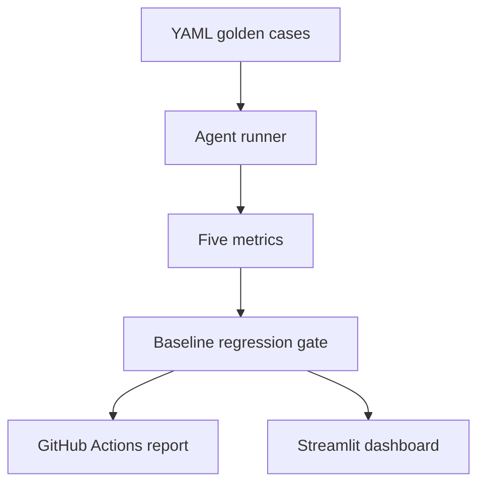

# AgentEval

[](https://agenteval-6honbe24hradazngswxkrq.streamlit.app/)

**CI for AI agents — pytest and GitHub Actions style evaluation for LLM systems.**

AgentEval runs an agent against YAML golden suites, scores five reliability metrics, compares results with a versioned baseline, and turns regressions into a reviewable CI decision.

**[Open the live dashboard](https://agenteval-6honbe24hradazngswxkrq.streamlit.app/)**

## Why AgentEval

LLM agents are probabilistic. A prompt, model, or tool change can improve one answer while silently reducing correctness elsewhere, increasing hallucinations, or raising latency and cost. Traditional unit tests remain useful for deterministic code, but they do not fully cover model outputs, tool routing, or quality drift across versions.

AgentEval adds the missing evaluation layer:

- YAML-defined golden test cases
- deterministic-first scoring with an LLM judge only for open-ended answers
- baseline comparison and configurable regression gates
- explicit agent, evaluator, missing-case, and skipped-case failures
- a Streamlit dashboard for summary, regression, and case-level inspection
- GitHub Actions automation with a six-case smoke suite and optional 21-case full suite
- reviewable adversarial variants that remain outside blocking CI until approved

## Evaluation flow



1. Define the prompt, ground truth, required tools, and tolerance in YAML.
2. Run each case through an adapter for the agent under test.
3. Score the output and store a provenance-linked JSON run.
4. Compare the current report with a versioned baseline.
5. Fail CI when configured quality gates or case-integrity checks are violated.
6. Inspect suite and case-level evidence in the dashboard.

## Five metrics

| Metric | What it evaluates | Implementation |
|---|---|---|
| **Correctness** | Whether the answer matches the expected result | Exact, contains, numeric, numeric-table, or LLM-judge checks |
| **Hallucination rate** | Unsupported numeric or factual claims | Deterministic ground-truth comparison |
| **Tool-call accuracy** | Whether the required tools were invoked | Precision, recall, and suite-level F1 |
| **Latency** | Response-time distribution | p50 and p95 wall-clock latency |
| **Cost** | Estimated or provider-reported usage cost | Per-case and suite-level USD estimate |

Correctness uses the exact tolerance configured in YAML. Hallucination detection applies a separate minimum absolute tolerance of 0.01 for harmless numeric formatting noise; that floor cannot convert an incorrect answer into a correctness pass.

## Failure taxonomy and gate integrity

AgentEval distinguishes output quality from execution and evaluation failures:

| Status | Meaning | Quality denominators | Default gate behaviour |
|---|---|---:|---|
| `failed` | The agent ran but failed an expectation | Included | Can fail metric gates |
| `agent_error` | Provider, ingestion, SQL, adapter, or execution failure | Excluded | Fails loudly |
| `evaluator_error` | The evaluator or LLM judge could not produce a valid decision | Excluded | Fails loudly |
| `skipped` | A case produced no scored result | Excluded | Fails loudly |
| `missing` | A baseline case is absent from the current run | Not applicable | Fails loudly |

Infrastructure failures are not counted as incorrect or hallucinated answers, so provider outages do not corrupt quality rates. They remain visible and fail the regression gate by default. Missing and skipped cases are also gated to prevent an incomplete run from appearing healthy.

## Flakiness detection

LLM agents can produce different answers for the same prompt even when the code and inputs have not changed. AgentEval's opt-in repeat mode separates two different problems: an agent can be **consistently wrong** (the same failing verdict every time) or **flaky** (the verdict or comparable numeric value changes across observations). The report stores both consistency and pass rate so repeatability is never mistaken for correctness.

Run the normal suite once and repeat only explicitly selected cases:

```bash
python -m agenteval run \
  --agent agentic_data_analyst \
  --repeat 5 \
  --repeat-case total_customers \
  --repeat-case avg_monthly_charges
```

`--repeat 5` means five total observations for each selected case: the primary suite result plus four additional invocations. Requiring explicit `--repeat-case` values prevents an accidental N-times increase in API calls across the full suite. The default `--repeat 1` follows the existing single-pass path without creating flakiness evidence.

| Classification | Consistency score |
|---|---:|
| `stable` | `1.0` |
| `flaky` | `0.80` to `<1.0` |
| `unstable` | `<0.80` |

These labels are documented defaults rather than information-losing buckets: every artifact retains the raw consistency fraction, such as `4/5`, so thresholds can be adjusted later.

Scalar numeric cases use `largest_complete_link_cluster`. Values cluster when the difference between the cluster maximum and minimum remains within the case's existing `numeric_tolerance`; the largest same-verdict cluster wins, and the primary observation receives no special preference. Exact, contains, and LLM-judge cases use verdict consistency. Ambiguous scalar numeric answers and numeric-table cases also fall back to verdict-only consistency.

Flakiness is observability-only in this phase. It does not affect the regression gate or baseline comparison. Evidence is stored separately under `runs/<agent>/flakiness/<run_id>.json`, keeping repeated latency, cost, answers, and verdicts isolated from the primary run report.

## Golden case example

```yaml
- id: avg_tenure_months
  prompt: "What is the average tenure in months?"
  expects:
    correctness_type: numeric
    must_call_tools: [sql_agent]
    must_not_hallucinate: true
    ground_truth: 25.23
    numeric_tolerance: 0.05
```

The current analyst suite contains 21 hand-written cases grounded in the demonstration dataset.

## Dashboard evidence

AgentEval is integrated with [Agentic Data Analyst](https://github.com/nishanttyagi28/agentic-data-analyst), a modular application that routes natural-language questions to SQL, ML, statistics, forecasting, reporting, and RAG components.

### Historical run summary


The screenshot records a specific historical run; it is evidence from that run, not a claim about the current deployment state.

### Regression trade-off


The comparison view exposes trade-offs instead of collapsing health into one number. In the recorded example, correctness improved from 85.7% to 95.2%, while p95 latency and estimated cost both increased.

### Failure drill-down


A numeric answer of approximately 25 months failed against a ground truth of 25.23 with a tolerance of 0.05. The ground truth was intentionally preserved rather than loosened to produce a green result.

## Quickstart

Python 3.12 is used by the CI workflow.

```bash
# Keep both repositories as siblings
git clone https://github.com/nishanttyagi28/agentic-data-analyst
git clone https://github.com/nishanttyagi28/agenteval

python -m pip install -r agenteval/requirements.txt
python -m pip install -r agentic-data-analyst/requirements.txt

export AGENTIC_ANALYST_PATH="$PWD/agentic-data-analyst"

# Run all golden cases
python -m agenteval run

# Compare a current report with the versioned baseline
python -m agenteval compare \
  --baseline agenteval/baselines/data_analyst.json \
  --current agenteval/runs/<run>.json

# Launch the dashboard
python -m streamlit run agenteval/dashboard/app.py
```

The repositories must share the same parent directory so Python can resolve the `agenteval` package and the sibling agent dependency.

## GitHub Actions

`.github/workflows/eval.yml` runs on pull requests and manual dispatch:

- deterministic unit tests and CLI validation run first
- an internal pull request or manual dispatch can run the live evaluation
- pull requests use six selected smoke cases
- manual dispatch with `full_suite=true` runs all 21 golden cases
- the current report is compared with the versioned baseline
- evidence is uploaded as a workflow artifact
- a generated Markdown report is created or updated on the pull request
- missing `GROQ_API_KEY` produces an explicit skipped-evaluation summary
- concurrency cancellation and job timeouts prevent stale or runaway runs

## Adversarial robustness

Generate reviewable, expectation-preserving candidates:

```bash
python -m agenteval generate \
  --cases agenteval/tests/golden/analyst_cases.yaml \
  --variants 3 \
  --output agenteval/tests/adversarial/candidates.yaml
```

Each candidate retains its parent case, ground truth, tool expectations, and mutation type. New variants start with `review_status: candidate` and are not added to the blocking golden gate until reviewed.

## Project structure

```text
agenteval/
├── agents.yaml           # Registered agents, adapters, suites, and gate defaults
├── adapters/             # Agent interface and concrete adapter
├── core/
│   ├── schema.py         # Test-case and run-report models
│   ├── runner.py         # Suite execution
│   ├── flakiness.py      # Repeat consistency analysis and classification
│   ├── metrics.py        # Correctness, hallucination, tools, latency, cost
│   ├── judge.py          # LLM judge for open-ended correctness
│   ├── compare.py        # Baseline comparison and CI decision
│   ├── provenance.py     # Reproducibility metadata
│   └── store.py          # JSON run persistence
├── dashboard/app.py      # Streamlit dashboard
├── tests/golden/         # Hand-written YAML suite
├── baselines/            # Versioned baseline reports
├── runs/                 # Standard single-pass run artifacts
│   └── <agent>/
│       └── flakiness/    # Isolated repeated-run evidence by run_id
└── .github/workflows/    # CI regression workflow
```

## Testing

```bash
python -m pip install -r requirements-dev.txt
python -m pytest -q
python -m agenteval --help
python -m agenteval compare --help
```

Deterministic tests cover schema and metrics behaviour, error handling, baseline comparison, missing/skipped-case gates, adversarial generation, provenance, and CLI paths without requiring a live provider call.

## Current limitations

- The included adapter and golden suite are demonstrated primarily with Agentic Data Analyst.
- Live evaluation requires the sibling agent repository, its runtime dependencies, and `GROQ_API_KEY`.
- LLM-judge correctness is reserved for open-ended cases and introduces provider dependence.
- Adversarial candidates require human review before entering blocking evaluation.
- Cost falls back to a character-based token estimate when provider usage is unavailable.
- Flakiness is not yet part of CI gating and has no cross-agent comparison view.
- Numeric-table flakiness currently compares verdicts only rather than extracting and clustering each table cell.
- The smoke suite's only scalar numeric case currently falls back to verdict consistency because its answer restates the same count; `largest_complete_link_cluster` is covered deterministically but has not yet been exercised by a live CI repeat run.

## License

AgentEval is available under the [MIT License](LICENSE).

---

Built by [Nishant Tyagi](https://github.com/nishanttyagi28).
