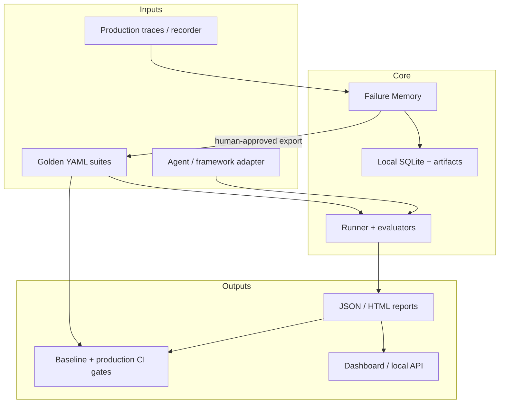

# AgentEval

[](https://github.com/nishanttyagi28/agenteval/actions/workflows/eval.yml)
[](https://pypi.org/project/nishanttyagi-agenteval/)
[](LICENSE)
[](pyproject.toml)

**CI for AI agents that turns production failures into minimized regression tests.**

AgentEval is a **git-native, CLI-first, local-first** evaluation harness for multi-step LLM agents. It runs YAML golden suites, scores reliability metrics, compares results to a versioned baseline, and fails CI when agent behavior regresses.

**v0.3.0** adds **Agent Failure Memory**: secure capture → redaction → clustering → replay → minimization → human approval → golden YAML → CI — so the same production failure cannot silently return.

| | |
|---|---|
| **Install** | `pip install nishanttyagi-agenteval==0.3.0` |
| **Import / CLI** | `agenteval` |
| **Distribution** | [`nishanttyagi-agenteval`](https://pypi.org/project/nishanttyagi-agenteval/0.3.0/) |
| **Release** | [v0.3.0 on GitHub](https://github.com/nishanttyagi28/agenteval/releases/tag/v0.3.0) |
| **Live demo** | [Static site](https://nishanttyagi28.github.io/agenteval/) · [Streamlit dashboard](https://agenteval-6honbe24hradazngswxkrq.streamlit.app/) |

AgentEval is open source (MIT). It does not replace hosted observability platforms; it focuses on **repeatable evaluation and regression gates** you can run in pull requests.

---

## Table of contents

- [Five-minute quick start](#five-minute-quick-start)
- [Failure Memory flagship workflow](#failure-memory-flagship-workflow)
- [What AgentEval evaluates](#what-agenteval-evaluates)
- [v0.3.0 highlights](#v030-highlights)
- [Zero-network demo](#zero-network-demo)
- [Architecture](#architecture)
- [Framework and integration support](#framework-and-integration-support)
- [CI and GitHub Action](#ci-and-github-action)
- [Security and privacy defaults](#security-and-privacy-defaults)
- [Installation and development](#installation-and-development)
- [Documentation and links](#documentation-and-links)
- [Limitations and non-goals](#limitations-and-non-goals)
- [Contributing](#contributing)
- [License](#license)

---

## Five-minute quick start

### Install from PyPI

```bash
pip install nishanttyagi-agenteval==0.3.0
agenteval --version
agenteval --help
agenteval memory --help
```

Expected version line: `agenteval 0.3.0`.

### Flagship demo (zero network, no API key)

Clone the repository so example scripts are available, then from the repo root:

```bash
pip install -e ".[dev]"
python examples/failure_memory_demo_v21/run_demo.py
```

This offline demo captures synthetic production failures, redacts secrets, clusters them, replays, minimizes, exports a golden case, fails a broken agent, passes a fixed agent, and checks coverage. Sample output:

```text
clusters=1
recurring=1
replay_outcome=reproduced ratio=1.00
minimization_id=min_… size 701->516 (-26.39%)
[1/1] prod_v21_refund_min FAIL  tools=cancel_order
[1/1] prod_v21_refund_min PASS  tools=lookup_order,issue_refund
coverage_pct=100.0 resurfaced=1
ci_gate_passed=True errors=[]
redaction_scan=clean
demo V2.1 OK
```

### Evaluate a mock agent (no provider)

From a clone of this repository (after `pip install -e .`):

```bash
agenteval run --agent mock_agent --registry examples/mock_agent/agents.yaml
agenteval compare --agent mock_agent --registry examples/mock_agent/agents.yaml
```

Scaffold a new project:

```bash
agenteval init
```

---

## Failure Memory flagship workflow

**Agent Failure Memory** turns a real production failure into a human-approved, versioned regression case.

```text
Production failure
  → secure redaction
  → ingestion
  → deterministic clustering
  → replay
  → automatic minimization
  → human approval
  → golden YAML
  → CI regression gate
  → recurrence detection
```


```mermaid
flowchart LR
  Fail["Production failure"] --> Redact["Redact secrets"]
  Redact --> Ingest["Ingest / store"]
  Ingest --> Cluster["Classify + cluster"]
  Cluster --> Replay["Replay"]
  Replay --> Min["Minimize"]
  Min --> Human["Human approve"]
  Human --> Golden["Golden YAML"]
  Golden --> CI["CI regression gate"]
  CI --> Recur["Recurrence / coverage"]
```

| Principle | Behavior |
|-----------|----------|
| Capture off by default | Content (prompts/outputs) is not stored unless you opt in |
| Redaction first | Secrets and common PII patterns are redacted before SQLite/JSONL write |
| Deterministic clustering | Taxonomy + fingerprints; no mandatory embeddings or LLM judge |
| Replay | Separates reproducible failures from infrastructure noise |
| Minimization | Delta-debug style reduction while preserving reproduction |
| Human approval | Required before any golden export; nothing auto-enters blocking CI |
| CI loop | Approved cases run with `agenteval run --production-cases …` |
| Resurfacing | Coverage / recurrence signals when a known failure returns |

Typical CLI surface:

```bash
agenteval memory init
agenteval memory ingest traces.jsonl
agenteval memory cluster
agenteval memory list
agenteval memory review <candidate_id> approve --correctness-type contains --ground-truth "…"
agenteval memory replay <candidate_id>
agenteval memory minimize <candidate_id>
agenteval memory approve-minimization <minimization_id>
agenteval memory export-minimized <minimization_id>
agenteval memory coverage
agenteval run --agent my_agent --production-cases .agenteval/production-regressions.yaml
```

Default database: `.agenteval/failure-memory.db` (override via `--db` or `AGENTEVAL_FAILURE_MEMORY_DB`).

Full operator guide: [`docs/failure-memory.md`](docs/failure-memory.md).

---

## What AgentEval evaluates

| Capability | What you get |
|------------|----------------|
| **YAML golden suites** | Versioned prompts, expectations, tools, tags |
| **Correctness** | Exact, contains, numeric, numeric-table, optional LLM judge |
| **Hallucination rate** | Unsupported claims vs ground truth |
| **Tool-call accuracy** | Required tools: precision / recall / F1 |
| **Latency & cost** | p50/p95 and suite cost; opt-in budget gates |
| **Trajectory** | Expected step sequences (LCS F1) and `agenteval diff` |
| **Flakiness** | Optional repeats and consistency labels |
| **Baseline regression** | Compare current run to a versioned baseline; CI exit codes |
| **RAG mode** | Context relevance, faithfulness, citation checks |
| **SQL Agent Safety Scanner** | Structural, policy, and related SQL safety tiers |
| **Adapters** | CrewAI, AutoGen, OpenAI Agents SDK, LangGraph, custom |
| **GitHub Action** | Composite action + regression workflow |
| **Dashboards & reports** | Streamlit app, HTML reports, local read-only API |
| **Failure Memory** | Production failure → approved golden regression (v0.3.0) |

<details>
<summary>Core evaluation flow (pre–Failure Memory)</summary>

1. Define golden cases in YAML.
2. Run the agent through a framework adapter.
3. Score metrics and write a provenance-linked JSON run.
4. Compare with a versioned baseline.
5. Fail CI when gates or integrity checks fail.
6. Inspect evidence in the dashboard or HTML report.

</details>

---

## v0.3.0 highlights

Shipped in package **AgentEval v0.3.0** ([release notes](https://github.com/nishanttyagi28/agenteval/releases/tag/v0.3.0), [CHANGELOG](CHANGELOG.md)):

- **Failure Memory Engine** — local SQLite store and `agenteval memory` CLI
- **Secure trace ingestion** — JSONL + recorder with redaction before persistence
- **Deterministic fingerprints and clustering** — explainable, no embeddings required
- **Sync and async instrumentation** — lightweight recorder paths
- **Replay adapter contract** — including offline `FakeReplayAdapter`
- **Deterministic delta-debugging minimizer** — shrink payloads while preserving reproduction
- **Human-approved minimized golden export** — no fallback to unapproved originals
- **Recurrence and resurfacing analytics** — recurring/novel fingerprints and coverage
- **CI Failure Memory coverage policies** — opt-in workflow and `memory coverage` gate
- **OTel-compatible JSON interchange** — optional interchange helpers
- **SQLite schema migrations** — versioned upgrades (V2.1 tables from schema v3+)
- **Zero-network flagship demo** — `examples/failure_memory_demo_v21/run_demo.py`

**Release verification results** (main at release; not a permanent guarantee):

| Suite | Result |
|-------|--------|
| Full deterministic suite | **1115 passed, 1 skipped** |
| Failure Memory suite | **59 passed** |
| Public package | [`nishanttyagi-agenteval==0.3.0`](https://pypi.org/project/nishanttyagi-agenteval/0.3.0/) on PyPI |

---

## Zero-network demo

| Demo | Command | Covers |
|------|---------|--------|
| **V2.1 flagship** | `python examples/failure_memory_demo_v21/run_demo.py` | Replay, minimize, recurrence, CI coverage, redaction scan |
| **V2 core loop** | `python examples/failure_memory_demo/run_demo.py` | Capture → cluster → approve → export → fail/pass |

Both use a **fresh temporary directory** by default, need **no API keys**, and perform **no network I/O**. Keep artifacts with `--workdir … --keep` (see each demo’s README).

Do not commit `.agenteval/failure-memory.db`, raw traces, or generated golden files that may contain residual sensitive data.

---

## Architecture


```mermaid
flowchart TB
  subgraph Inputs
    Agent["Agent / framework adapter"]
    Cases["Golden YAML suites"]
    Prod["Production traces / recorder"]
  end

  subgraph Core
    Runner["Runner + evaluators"]
    FM["Failure Memory"]
    SQLite["Local SQLite + artifacts"]
  end

  subgraph Outputs
    Report["JSON / HTML reports"]
    Gate["Baseline + production CI gates"]
    Dash["Dashboard / local API"]
  end

  Agent --> Runner
  Cases --> Runner
  Prod --> FM
  FM --> SQLite
  FM -->|"human-approved export"| Cases
  Runner --> Report
  Report --> Gate
  Report --> Dash
  Cases --> Gate
```

Everything above is implemented in-repo: adapters under `adapters/`, evaluation under `core/`, Failure Memory under `failure_memory/`, CLI entry `agenteval` → `agenteval.cli:main`, optional Streamlit dashboard, and composite GitHub Action (`action.yml`).

---

## Framework and integration support

| Integration | Notes |
|-------------|--------|
| **CrewAI** | Optional extra `crewai` |
| **Microsoft AutoGen** | Optional extra `autogen` |
| **OpenAI Agents SDK** | Optional extra `openai-agents` |
| **LangGraph** | Adapter present; install LangGraph in the agent environment |
| **Custom** | Implement `AgentAdapter.run(prompt) -> AgentResponse` |
| **Composite Action** | `nishanttyagi28/agenteval@v0.3.0` (or a stable major tag when you pin one) |
| **Templates** | `agenteval templates` — RAG, coding, customer-support starters |
| **Plugins** | Entry-point correctness evaluators |

Example registry fragment:

```yaml
version: 1
agents:
  mock_agent:
    adapter: examples.mock_agent.adapter:MockAgentAdapter
    cases: examples/mock_agent/cases.yaml
    enabled: true
```

---

## CI and GitHub Action

Built-in workflow [`.github/workflows/eval.yml`](.github/workflows/eval.yml): deterministic tests first, optional live evaluation, baseline compare, HTML report artifacts.

Composite action ([`action.yml`](action.yml)) for consumer repos:

```yaml
- uses: nishanttyagi28/agenteval@v0.3.0
  with:
    agent: my_agent
    config-file: agents.yaml
    agent-path: .
    cases-file: tests/golden/cases.yaml
    baseline-file: baselines/my_agent.json
```

Optional Failure Memory coverage workflow: [`.github/workflows/failure-memory.yml`](.github/workflows/failure-memory.yml) (path-filtered / `workflow_dispatch`).

Consumer example: [`examples/github-actions/agenteval.yml`](examples/github-actions/agenteval.yml).

---

## Security and privacy defaults

| Default | Meaning |
|---------|---------|
| **Content capture off** | Prompts/outputs are not stored unless explicitly enabled |
| **Redaction before disk** | Applied before SQLite and JSONL persistence/export |
| **Best-effort DLP** | Common secret/PII patterns only — not a universal guarantee |
| **Human approval** | Required for golden promotion; no automatic approvals |
| **Local-first SQLite** | Default DB under `.agenteval/`; no hosted multi-tenant control plane |
| **No telemetry by default** | Tracing is local; Failure Memory does not phone home |
| **Keep secrets out of git** | Do not commit DBs, raw traces, or sensitive generated suites |

---

## Installation and development

```bash
# Users
pip install nishanttyagi-agenteval==0.3.0

# Contributors (from a clone)
python -m pip install -e ".[dev]"
python -m pytest -q
python -m pytest tests/failure_memory -q
agenteval --help
```

Requires **Python 3.10+**. Framework extras are optional (`crewai`, `autogen`, `openai-agents`).

---

## Documentation and links

| Resource | URL |
|----------|-----|
| Repository | https://github.com/nishanttyagi28/agenteval |
| PyPI | https://pypi.org/project/nishanttyagi-agenteval/ |
| v0.3.0 release | https://github.com/nishanttyagi28/agenteval/releases/tag/v0.3.0 |
| Changelog | [CHANGELOG.md](CHANGELOG.md) |
| Failure Memory docs | [docs/failure-memory.md](docs/failure-memory.md) |
| Compatibility | [docs/compatibility.md](docs/compatibility.md) |
| SQL scanner | [docs/sql-scanner.md](docs/sql-scanner.md) |
| Contributing | [CONTRIBUTING.md](CONTRIBUTING.md) |
| Static demo | https://nishanttyagi28.github.io/agenteval/ |
| Streamlit dashboard | https://agenteval-6honbe24hradazngswxkrq.streamlit.app/ |

Additional topic docs: [templates](docs/templates.md), [plugins](docs/plugins.md), [multi-turn](docs/multi-turn-evaluation.md), [tool efficiency](docs/tool-efficiency.md), [red-team generation](docs/redteam-generation.md).

---

## Limitations and non-goals

- **Local-first and single-user** Failure Memory — not a hosted multi-tenant control plane
- **Not an OpenTelemetry collector** — optional OTel-shaped JSON helpers only
- **No mandatory vector database** or embedding API for clustering
- **No mandatory LLM judge** for classification or clustering
- **Redaction cannot identify every arbitrary unlabeled secret**
- Clustering/benchmark timings **depend on local hardware**
- Live agent evaluation still needs your agent runtime and any provider keys you choose
- Cost may fall back to estimates when providers omit usage
- Adversarial / generated cases stay `review_status: candidate` until humans promote them

---

## Contributing

See [CONTRIBUTING.md](CONTRIBUTING.md) for setup, tests, and PR expectations.

Issues labeled [`good first issue`](https://github.com/nishanttyagi28/agenteval/issues?q=is%3Aissue+is%3Aopen+label%3A%22good+first+issue%22) are a good starting point.

---

## License

AgentEval is available under the [MIT License](LICENSE).
